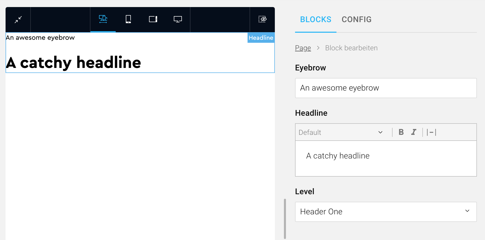
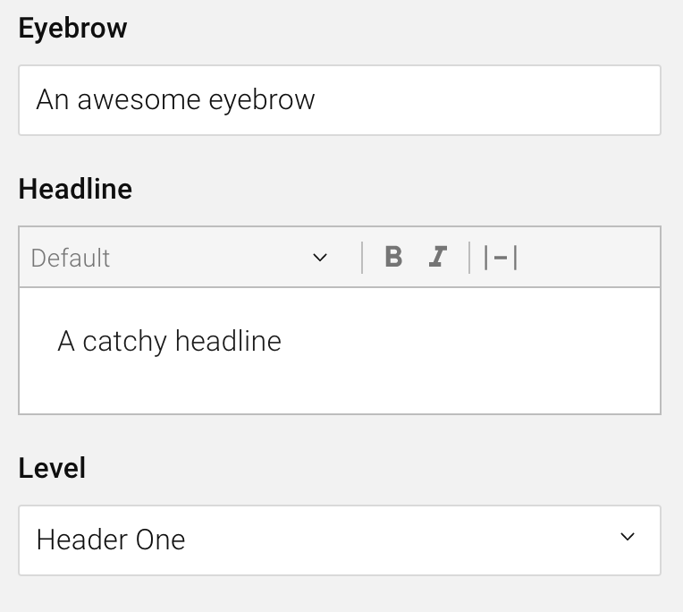
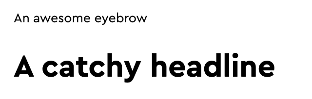

import CodeBlock from "@theme/CodeBlock";

Blocks are the primary building patterns of a COMET DXP CMS application. In this guide, you will learn how to create your first block, from beginning to end.

<!-- TODO: Be more specific: Three parts, API, admin and site -->

## The Block: Headline

The block we're going to create is a basic headline block. The block consists of the actual **headline** (a rich text), an **eyebrow text** above the **headline** (a plain string), and the level of the headline (h1-h6).


_The Headline block we're going to create. On the left side, you can see a preview of the block in the frontend (site). On the right side, you can see the admin component used to fill the block with content._

## Part One: Creating the Block in the API

The first step is to create the block in the API. Here we define how the block is stored in the database and which data is sent to the admin and the site. In the API, the block is divided into two parts: The block data, the data which is stored, and the block input, the data that is sent from the admin to create a new instance of a block.

<!-- TODO: create or update the blocks data -->

### Define the Block Data

The block data defines how a block is stored in the database. We need to store the eyebrow text, the headline rich text, and the headline level for our Headline block. Therefore the block data should be the following:

```ts title="headline.block.ts"
export enum HeadlineLevel {
    HeaderOne = "header-one",
    HeaderTwo = "header-two",
    HeaderThree = "header-three",
    HeaderFour = "header-four",
    HeaderFive = "header-five",
    HeaderSix = "header-six",
}

class HeadlineBlockData extends BlockData {
    @BlockField({ nullable: true })
    eyebrow?: string;

    @ChildBlock(RichTextBlock)
    headline: BlockDataInterface;

    @BlockField({ type: "enum", enum: HeadlineLevel })
    level: HeadlineLevel;
}
```

The `@BlockField` and `@ChildBlock` decorators are used to create the block meta, which is used by the admin and the site to generate TypeScript interfaces for the block automatically. This feature is inspired by [NestJS' GraphQL code first approach](https://docs.nestjs.com/graphql/quick-start#code-first).

Note how we use the `RichTextBlock`, a COMET DXP block, to create our Headline block. Composing a block out of child blocks and additional fields is no problem!

### Define the Block Input

Once we have defined the block data, we also need to define the block input. The block input is used to create a new instance of a block. To be more precise, the block input is used to create the block data, which is stored in the database. In most cases, the block input is nearly identical to the block data. For our headline block, the block input should be the following:

<!-- TODO Add a comparison to GraphQL object and input type -->

```ts title="headline.block.ts"
import { blockInputToData } from "@comet/cms-api";

class HeadlineBlockInput extends BlockInput {
    @IsUndefinable()
    @IsString()
    @BlockField({ nullable: true })
    eyebrow?: string;

    @ChildBlockInput(RichTextBlock)
    headline: ExtractBlockInput<typeof RichTextBlock>;

    @IsEnum(HeadlineLevel)
    @BlockField({ type: "enum", enum: HeadlineLevel })
    level: HeadlineLevel;

    transformToBlockData(): HeadlineBlockData {
        return blockInputToData(HeadlineBlockData, this);
    }
}
```

Note the method called `transformToBlockData()`. This method transforms the block input into the savable block data. As this method is nearly identical for all blocks, we provide a `blockInputToData` method to create the intended outcome.

### Create and Register the Block

Now that our block data and block input are defined, we need to create the block and register it in a page document. Typically, the page document has a root block called `PageContentBlock`. In this `PageContentBlock`, we now register the newly created Headline block:

```ts title="headline.block.ts"
export const HeadlineBlock = createBlock(HeadlineBlockData, HeadlineBlockInput, "Headline");
```

```ts title="page-content.block.ts"
export const PageContentBlock = createBlocksBlock(
    {
        supportedBlocks: {
            richText: RichTextBlock,
            image: ImageBlock,
            space: SpaceBlock,
            headline: HeadlineBlock, // Newly added HeadlineBlock
        },
    },
    "PageContent",
);
```

The `PageContentBlock` is created using the `createBlocksBlock` helper, which is one of multiple blocks helper. You may ignore the specifics of this root block for now.

### Part One - Done!

You've just created your first block in the API. The next step is to create the block in the admin (the CMS backend).

The complete code for our Headline API block (including all necessary imports) can be found here:

<details>
    <summary>headline.block.ts</summary>
    <div>
        <CodeBlock language="ts">
            {`import {
    BlockData,
    BlockDataInterface,
    BlockField,
    BlockInput,
    ChildBlock,
    ChildBlockInput,
    createBlock,
    ExtractBlockInput,
    blockInputToData,
} from "@comet/cms-api";
import { RichTextBlock } from "@src/common/blocks/rich-text.block";
import { IsUndefinable } from "@comet/cms-api";
import { IsEnum, IsString } from "class-validator";\n
export enum HeadlineLevel {
    HeaderOne = "header-one",
    HeaderTwo = "header-two",
    HeaderThree = "header-three",
    HeaderFour = "header-four",
    HeaderFive = "header-five",
    HeaderSix = "header-six",
}\n
export class HeadlineBlockData extends BlockData {
    @BlockField()
    eyebrow?: string;\n
    @ChildBlock(RichTextBlock)
    headline: BlockDataInterface;\n
    @BlockField({ type: "enum", enum: HeadlineLevel })
    level: HeadlineLevel;
}\n
export class HeadlineBlockInput extends BlockInput {
    @IsUndefinable()
    @IsString()
    @BlockField()
    eyebrow?: string;\n
    @ChildBlockInput(RichTextBlock)
    headline: ExtractBlockInput<typeof RichTextBlock>;\n
    @IsEnum(HeadlineLevel)
    @BlockField({ type: "enum", enum: HeadlineLevel })
    level: HeadlineLevel;\n
    transformToBlockData(): HeadlineBlockData {
        return blockInputToData(HeadlineBlockData, this);
    }
}\n
export const HeadlineBlock = createBlock(HeadlineBlockData, HeadlineBlockInput, "Headline");
`}
        </CodeBlock>
    </div>
</details>

## Part Two: Creating the Block in the Admin (CMS Backend)

The second step is to create the block in the admin. The admin is where our users will create new instances of our Headline block and fill it with actual content.

### Creating the Block With `createCompositeBlock`

```tsx title="HeadlineBlock.tsx"
export const HeadlineBlock = createCompositeBlock(
    {
        name: "Headline",
        displayName: "Headline",
        blocks: {
            eyebrow: {
                block: createCompositeBlockField<HeadlineBlockData["eyebrow"]>({
                    defaultValue: undefined,
                    AdminComponent: ({ state, updateState }) => (
                        <BlocksFinalForm<Pick<HeadlineBlockData, "eyebrow">>
                            onSubmit={({ eyebrow }) => updateState(eyebrow)}
                            initialValues={{ eyebrow: state }}
                        >
                            <TextField name="eyebrow" label="Eyebrow" fullWidth />
                        </BlocksFinalForm>
                    ),
                }),
            },
            headline: {
                block: RichTextBlock,
                title: "Headline",
            },
            level: {
                block: createCompositeBlockField<HeadlineBlockData["level"]>({
                    defaultValue: "header-one",
                    AdminComponent: ({ state, updateState }) => (
                        <BlocksFinalForm<Pick<HeadlineBlockData, "level">>
                            onSubmit={({ level }) => updateState(level)}
                            initialValues={{ level: state }}
                        >
                            <SelectField name="level" label="Level" fullWidth>
                                <MenuItem value="header-one">Header One</MenuItem>
                                <MenuItem value="header-two">Header Two</MenuItem>
                                <MenuItem value="header-three">Header Three</MenuItem>
                                <MenuItem value="header-four">Header Four</MenuItem>
                                <MenuItem value="header-five">Header Five</MenuItem>
                                <MenuItem value="header-six">Header Six</MenuItem>
                            </SelectField>
                        </BlocksFinalForm>
                    ),
                }),
            },
        },
    },
    (block) => ({
        ...block,
        category: BlockCategory.TextAndContent,
    }),
);
```

Please note that the names of the keys of the `blocks` object must be the same as the name of fields in the API block (eyebrow, headline and level).

### The Admin Component


_The admin component of the Headline block_

The admin component is the primary way a user interacts with a block. For our Headline block, the admin component consists of a text field for the eyebrow text, a rich text editor for the headline, and a select for the headline level.

Let's take a look at how the admin component is defined in code. The text field for the **eyebrow text** is a plain Final Form field, used the same way you'd use it in any COMET DXP Admin application. The form is wrapped using `createCompositeBlockField`, which helps to integrate the form state into the block state. Also, note the use of the `HeadlineBlockData` type. This interface is generated using the block mentioned above meta -- how cool is that?!

```tsx title="HeadlineBlock.tsx"
eyebrow: {
    block: createCompositeBlockField<HeadlineBlockData["eyebrow"]>({
        defaultValue: undefined,
        AdminComponent: ({ state, updateState }) => (
            <BlocksFinalForm<Pick<HeadlineBlockData, "eyebrow">>
                onSubmit={({ eyebrow }) => updateState(eyebrow)}
                initialValues={{ eyebrow: state }}
            >
                <TextField name="eyebrow" label="Eyebrow" fullWidth />
            </BlocksFinalForm>
        ),
    }),
},
```

For the **headline** rich text, we're using the `RichTextBlock`, once again, the same as we did for the API block. Not how we use the `title` prop to identify the rich text as the headline.

```tsx title="HeadlineBlock.tsx"
headline: {
    block: RichTextBlock,
    title: "Headline",
},
```

For the **level** select, we're once again using a plain Final Form field in combination with createCompositeBlockField.

```tsx title="HeadlineBlock.tsx"
level: {
    block: createCompositeBlockField<HeadlineBlockData["level"]>({
        defaultValue: "header-one",
        AdminComponent: ({ state, updateState }) => (
            <BlocksFinalForm<Pick<HeadlineBlockData, "level">>
                onSubmit={({ level }) => updateState(level)}
                initialValues={{ level: state }}
            >
                <SelectField name="level" label="Level" fullWidth>
                    <MenuItem value="header-one">Header One</MenuItem>
                    <MenuItem value="header-two">Header Two</MenuItem>
                    <MenuItem value="header-three">Header Three</MenuItem>
                    <MenuItem value="header-four">Header Four</MenuItem>
                    <MenuItem value="header-five">Header Five</MenuItem>
                    <MenuItem value="header-six">Header Six</MenuItem>
                </SelectField>
            </BlocksFinalForm>
        ),
    }),
},
```

### Register the Block

In the same way, we registered the block in the API, we need to register our admin Headline block in the `PageContentBlock` of the admin:

```tsx title="PageContentBlock.tsx"
export const PageContentBlock = createBlocksBlock({
    name: "PageContent",
    supportedBlocks: {
        richText: RichTextBlock,
        image: ImageBlock,
        space: SpaceBlock,
        headline: HeadlineBlock, // Newly added HeadlineBlock
    },
});
```

Note how we are using `createBlocksBlock` once again? The helper is available for both the API and the admin part of your COMET DXP application!

### Part Two - Done!

Now that we've created and registered our Headline block in the admin as well, our users can already use the block and fill it with content. However, they can't see the block on their website yet! But no worries, we'll achieve just that in the third and final part of this guide.

The complete code for our Headline admin block (including all necessary imports) can be found here:

<details>
    <summary>HeadlineBlock.tsx</summary>
    <div>
        <CodeBlock language="ts">
            {`import { Field, FinalFormInput, FinalFormSelect } from "@comet/admin";
import { BlockCategory, BlocksFinalForm, createCompositeBlock, createCompositeBlockField, createRichTextBlock } from "@comet/cms-admin";
import { MenuItem } from "@material-ui/core";
import { HeadlineBlockData } from "@src/blocks.generated";
import { LinkBlock } from "@src/common/blocks/LinkBlock";\n
const RichTextBlock = createRichTextBlock({
    link: LinkBlock,
    rte: {
        maxBlocks: 1,
        supports: ["bold", "italic"],
        blocktypeMap: {},
    },
    minHeight: 0,
});\n
export const HeadlineBlock = createCompositeBlock(
    {
        name: "Headline",
        displayName: "Headline",
        blocks: {
            eyebrow: {
                block: createCompositeBlockField<HeadlineBlockData["eyebrow"]>({
                    defaultValue: undefined,
                    AdminComponent: ({ state, updateState }) => (
                        <BlocksFinalForm<Pick<HeadlineBlockData, "eyebrow">>
                            onSubmit={({ eyebrow }) => updateState(eyebrow)}
                            initialValues={{ eyebrow: state }}
                        >
                            <TextField name="eyebrow" label="Eyebrow" fullWidth />
                        </BlocksFinalForm>
                    ),
                }),
            },
            headline: {
                block: RichTextBlock,
                title: "Headline",
            },
            level: {
                block: createCompositeBlockField<HeadlineBlockData["level"]>({
                    defaultValue: "header-one",
                    AdminComponent: ({ state, updateState }) => (
                        <BlocksFinalForm<Pick<HeadlineBlockData, "level">>
                            onSubmit={({ level }) => updateState(level)}
                            initialValues={{ level: state }}
                        >
                            <SelectField name="level" label="Level" fullWidth>
                                <MenuItem value="header-one">Header One</MenuItem>
                                <MenuItem value="header-two">Header Two</MenuItem>
                                <MenuItem value="header-three">Header Three</MenuItem>
                                <MenuItem value="header-four">Header Four</MenuItem>
                                <MenuItem value="header-five">Header Five</MenuItem>
                                <MenuItem value="header-six">Header Six</MenuItem>
                            </SelectField>
                        </BlocksFinalForm>
                    ),
                }),
            },
        },
    },
    (block) => ({
        ...block,
        category: BlockCategory.TextAndContent,
    }),
);
`}
        </CodeBlock>
    </div>
</details>

## Part Three - Adding the Block to the Site {#partThree}

The site (or frontend) is responsible for rendering blocks and their content. Consequently, we also need to add our Headline block to the site. See the following code snippet on how to create the block for the site.

```tsx title="HeadlineBlock.tsx"
export const HeadlineBlock = withPreview(
    ({ data: { eyebrow, headline, level } }: PropsWithData<HeadlineBlockData>) => {
        return (
            <>
                {eyebrow && <small>{eyebrow}</small>}
                <RichTextBlock data={headline} renderers={getHeadlineRenderers(level)} />
            </>
        );
    },
    { label: "Headline" },
);
```

:::note

The `getHeadlineRenderers` method tells the site which heading section tag (h1-h6) should be used. As this implementation detail is not relevant for learning how to create a block, we'll not discuss it in detail.

:::

Note how we're using the generated `HeadlineBlockData` once again. Awesome!

### Register the Block

You might have already guessed it: We need to register the Headline block once again. Let's take a look at the `PageContentBlock` in the site:

```tsx title="PageContentBlock.tsx"
const supportedBlocks: SupportedBlocks = {
    richText: (props) => <RichTextBlock data={props} />,
    image: (props) => <ImageBlock data={props} />,
    space: (props) => <SpaceBlock data={props} />,
    headline: (props) => <HeadlineBlock data={props} />, // Newly added HeadlineBlock
};

export function PageContentBlock({ data }: PropsWithData<PageContentBlockData>) {
    return <BlocksBlock data={data} supportedBlocks={supportedBlocks} />;
}
```

Notice how the `PageContentBlock` looks slightly different from those in the API and admin parts? This is because we're writing actual React components for our blocks here and may extend the blocks with props specific to the site (e.g., the Image block may have an `aspectRatio` prop). The `PropsWithData` interface and the `data` prop are used to distinguish data that's coming from the API with props we're specifying on the site.

### Part Three - Done!

And that's it! Now we can use our (beautiful) Headline block on the site as well.


_The Headline block rendered in the site_

The complete code for our Headline site block (including all necessary imports) can be found here:

<details>
    <summary>HeadlineBlock.tsx</summary>
    <div>
        <CodeBlock language="tsx">
            {`import { PropsWithData, withPreview } from "@comet/site-nextjs";
import { HeadlineBlockData } from "@src/blocks.generated";
import { Renderers } from "redraft";\n
import { RichTextBlock } from "./RichTextBlock";\n
const headlineTags: { [key: string]: React.ElementType } = {
    "header-one": "h1",
    "header-two": "h2",
    "header-three": "h3",
    "header-four": "h4",
    "header-five": "h5",
    "header-six": "h6",
};\n
const getHeadlineRenderers = (level: HeadlineBlockData["level"]) => {
    const HeadlineTag = headlineTags[level];\n
    const renderers: Renderers = {
        inline: {
            BOLD: (children, { key }) => <strong key={key}>{children}</strong>,
            ITALIC: (children, { key }) => <em key={key}>{children}</em>,
        },
        blocks: {
            unstyled: (children, { keys }) => {
                return children.map((child, index) => <HeadlineTag key={keys[index]}>{child}</HeadlineTag>);
            },
        },
    };\n
    return renderers;
};\n
export const HeadlineBlock = withPreview(
    ({ data: { eyebrow, headline, level } }: PropsWithData<HeadlineBlockData>) => {
        return (
            <>
                {eyebrow && <small>{eyebrow}</small>}
                <RichTextBlock data={headline} renderers={getHeadlineRenderers(level)} />
            </>
        );
    },
    { label: "Headline" },
);
`}
        </CodeBlock>
    </div>
</details>

## Conclusion

In this guide, we've learned how to create a block in a COMET DXP CMS project from start to end. We first defined the structure of the block's data in the API, then created the admin component for users to interact with the block, and finally added the block to the site (frontend).

Now you should be ready to create additional blocks! Maybe even a Dog Ear block?

:::info

We've only covered the basic concepts of COMET DXP blocks in this guide. To get a full picture, please review the [blocks](/docs/core-concepts/blocks/) section in our documentation.

:::
