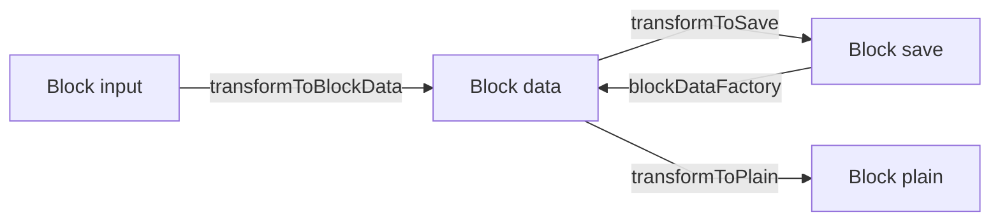
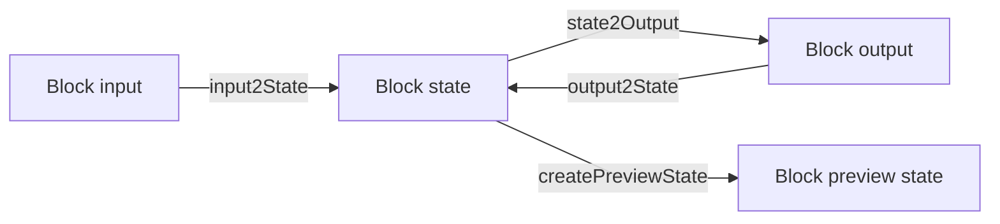
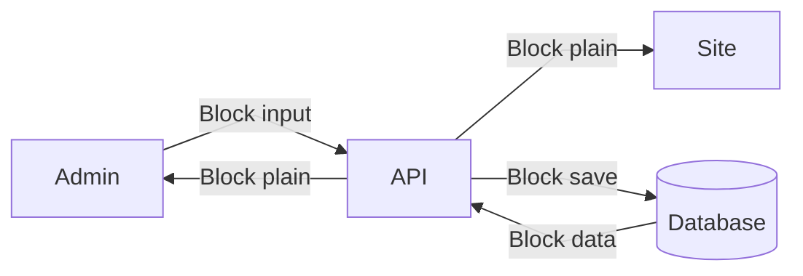

# Deep dive: A block's lifecycle

A block usually exists in all three microservices (API, Admin, and Site) and the database.
When transitioning between these microservices, the block is represented in different states, for instance, _block input_ or _block data_.
In this section, we show the different states a block can have.

## The block in the database

Blocks are stored as JSON columns in the database.
Blocks at the root level of the entity are called root blocks.
To add a block to an entity, the [custom type](https://mikro-orm.io/docs/custom-types) `RootBlockType` needs to be used:

<!-- TODO Add dedicated page for root blocks -->

```ts title=any.entity.ts
@Entity()
@RootBlockEntity()
class AnyEntity {
    /* Other fields */

    @RootBlock(DamImageBlock)
    // highlight-next-line
    @Property({ type: new RootBlockType(DamImageBlock) })
    image: BlockDataInterface;
}
```

When a block is converted to the database value, it is split into two fields, `data` and `index`.

- `data` contains the actual data of the block.
- `index` contains the index data of the block.
  The index data is a flat representation of all child blocks in a root block, including some meta information such as the block's path and visibility.
  The index can be used for different use cases, for instance, [linking to a block's dependencies](../dependencies).

When a block is converted to the JavaScript value, the index data is ignored, and only the block data is used.

<details>
    <summary>Example of an image block in the database</summary>

```json
{
    "data": {
        "attachedBlocks": [
            {
                "type": "pixelImage",
                "props": { "damFileId": "efbd89db-9b39-49fb-a0d7-6491ca228dec" }
            }
        ],
        "activeType": "pixelImage"
    },
    "index": [
        { "blockname": "DamImage", "jsonPath": "root", "visible": true },
        {
            "blockname": "PixelImage",
            "jsonPath": "root.attachedBlocks.0.props",
            "visible": true,
            "dependencies": [
                { "targetEntityName": "DamFile", "id": "efbd89db-9b39-49fb-a0d7-6491ca228dec" }
            ]
        }
    ]
}
```

</details>

## The block in the API

In the API, the block can have one of the four states: _data_, _plain_, _input_, or _save_.

- Block data is the data of a block instance in the API.
- Block plain is a block's data that is sent to the clients.
  It consists of the block data and optional additional fields.
  For instance, it may add a loaded DAM image to the block data, whereas the data only contains the image ID.
- Block input is the data that's coming from the Admin. It is used to create the block data.
- Block save is the block's data that is to be saved in the database.

<!-- TODO add a dedicated page on block plain transformation -->

:::tip

You can think of the block data as the GraphQL object type and the block input as the GraphQL input type.

:::

### Transitioning between states

<figure>



<figcaption>Different block states in the API</figcaption>

</figure>

The following methods are used to transition between the different block states:

- The `BlockInput#transformToBlockData` method is used to transition from input to data.
  You can usually use the `blockInputToData` helper for this.

    ```ts
    class HeadlineBlockInput extends BlockInput {
        /* ... */

        transformToBlockData(): HeadlineBlockData {
            return blockInputToData(HeadlineBlockData, this);
        }
    }
    ```

- The `transformToSave` function is used to transition from data to save.
  You likely won't call this function directly, since `RootBlockType` takes care of this.

    ```ts
    const headlineBlockData = /* Block instance in the API */;
    const headlineBlockSave = transformToSave(headlineBlockData);
    ```

- The `Block#blockDataFactory` method is used to transition from save to data.
  `RootBlockType` also takes care of this.

    ```ts
    const headlineBlockSave = /* Loaded from the database */;
    const headlineBlockData = HeadlineBlock.blockDataFactory(headlineBlockSave);
    ```

- The `transformToPlain` function is used to transition from data to plain.
  You will likely use the `BlocksTransformerService` for this.

    ```ts
    class PagesResolver {
        @ResolveField(() => RootBlockDataScalar(HeadlineBlock))
        async headline(@Parent() page: Page) {
            return this.blocksTransformer.transformToPlain(page.headline);
        }
    }
    ```

## The block in the Admin

In the Admin, the block can have one of the four states: _input_, _state_, _output_, or _preview state_.

- Block input is the data (transformed to plain) of a block coming from the API.
- Block state is the data of a block while editing.
- Block output is the data sent to the API when saving a block.
- Block preview state is the data sent to the preview while editing.

:::tip

The API's output (= data) is the Admin's input, and the Admin's output is the API's input.

:::

### Transitioning between states

<figure>



<figcaption>Different block states in the Admin</figcaption>

</figure>

The following methods are used to transition between the different block states:

- The `BlockInterface#input2State` method is used to transition from input to state.

    ```ts
    const headlineBlockInput = /* Block data from the API */;
    const headlineBlockState = HeadlineBlock.input2State(headlineBlockInput);
    ```

- The `BlockInterface#state2Output` method is used to transition from state to output.

    ```ts
    const headlineBlockState = /* Block state in the Admin */;
    const headlineBlockOutput = HeadlineBlock.state2Output(headlineBlockState);
    ```

- The `BlockInterface#output2State` method is used to transition from output to state.

    ```ts
    const headlineBlockOutput = /* Block output from the Admin */;
    const headlineBlockState = await HeadlineBlock.output2State(headlineBlockOutput);
    ```

- The `BlockInterface#createPreviewState` method is used to create a preview state.
  The preview state, together with the preview context, displays the block currently being edited in the block preview.

    ```ts
    const previewContext = /* Context for the preview, e.g., showVisibleOnly */

    const headlineBlockState = /* Block state in the Admin */;
    const headlineBlockPreviewState = HeadlineBlock.createPreviewState(headlineBlockState, previewContext);
    ```

## The block in the site

In the site, the block can only have one state: _plain_.
It is the transformed block data coming from the API.

## Full block lifecycle

Now that we've seen the different block states in all three microservices let's examine the big picture.
You can see a block's full lifecycle across the microservices in the following figure:

<figure>



<figcaption>Full block lifecycle</figcaption>

</figure>
