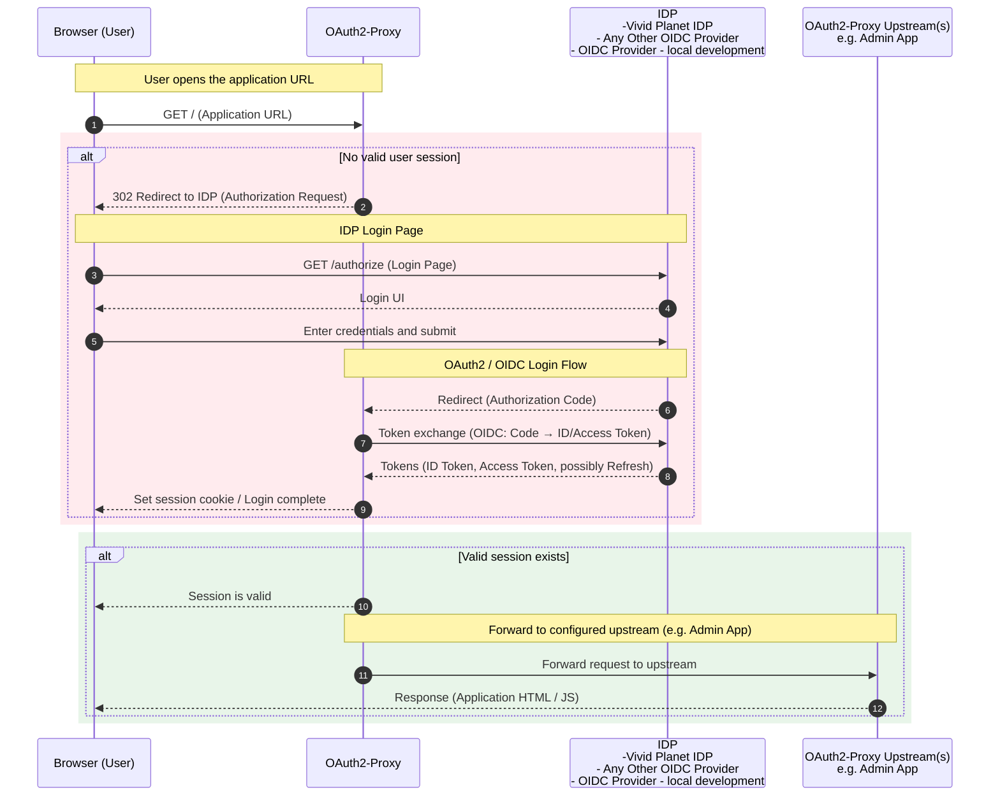
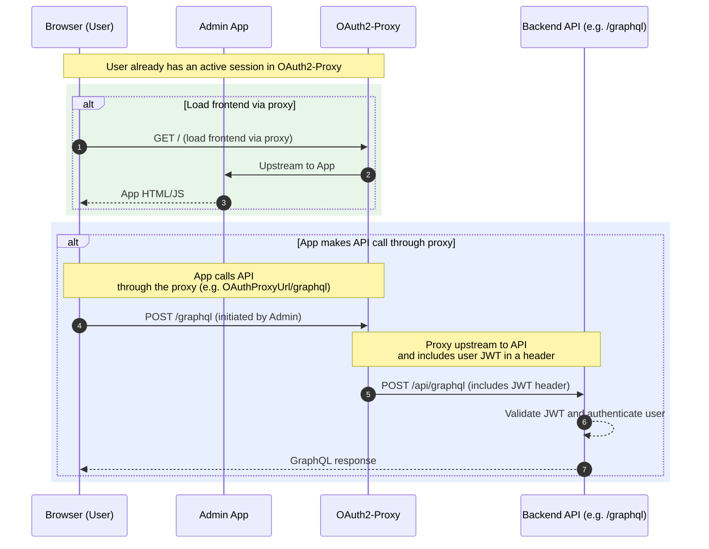

# Authentication

This page explains how users authenticate to a typical Comet Application (Admin App) using **standard OpenID Connect (OIDC)**.  
We rely on an [**OAuth2-Proxy**](https://oauth2-proxy.github.io/oauth2-proxy/) in front of the app. The proxy checks whether the user already has a valid session; if not, it redirects to the configured Identity Provider (IDP). After a successful login at the IDP, the proxy creates a session and forwards the request to the upstream application (e.g., the Admin App).

**Key points:**

- **Protocol:** OpenID Connect (Authorization Code Flow)
- **Components:** Browser → OAuth2-Proxy → IDP → Upstream (Admin App)
- **IDPs:** Vivid Planet IDP, Other OIDC Provider, or [Dev OIDC Provider](https://github.com/vivid-planet/dev-oidc-provider)
- **Outcome:** Only authenticated requests reach the upstream application

---

## Architecture Overview

1. **Browser (User)**: Accesses the application URL (which points to the proxy, not directly to the app).
2. **OAuth2-Proxy**: Gatekeeper in front of the app. It enforces authentication and manages the user session.
3. **Identity Provider (IDP)**: Performs the user login (username/password, SSO, MFA, etc.) and issues OIDC tokens.
4. **Upstream Application**: The actual app (e.g. Admin App) that receives requests only after the user is authenticated.

Result: The application itself doesn’t need to implement the login UI or token handling; the proxy handles the OIDC flow and session, then forwards allowed requests upstream.

## Sequence Diagram: Authentication Flow

### How it works:

1. The user opens the application URL in the browser and the proxy checks if a valid user session exists.
2. If no session is present, the proxy returns a 302 redirect to the IDP (OIDC authorization request).
3. The browser loads the IDP Login page and checks (/authorize) if the user is already logged in.
4. If the user is not logged in, The IDP renders the login UI (e.g. username/password, SSO, MFA).
5. The user enters their credentials and submits the form.
6. On successful authentication, the IDP redirects back to the proxy with an Authorization Code.
7. OAuth2-Proxy exchanges the code with the IDP for OIDC tokens (ID Token, Access Token, optionally Refresh Token).
8. IDP returns the tokens to OAuth2-Proxy.
9. OAuth2-Proxy sets a session cookie in the browser and marks the login as complete.
10. Checks if the user has a valid session (either newly created or existing).
11. If there is a valid session, the proxy forwards the original request to the configured upstream application (e.g. Admin App).
12. The upstream application processes the request and returns the response to the browser, where the application loads.

## Sequence Diagram: Authenticated Requests (App → API via Proxy)

Once the user is logged in, all requests from the frontend to the API also go through the OAuth2-Proxy.
The proxy automatically attaches the user’s JWT (JSON Web Token) to each API request so that the backend can validate and identify the user.
This ensures consistent authentication and authorization for both the UI and API.

### How it works:

1. The browser loads the frontend through the OAuth2-Proxy.
2. The frontend (Admin App) makes API calls to a proxied endpoint (e.g. /graphql), configured in the OAuth2-Proxy as an upstream.
3. OAuth2-Proxy detects that the request targets an API upstream and the user has a valid session.
4. Application performs an API request through the proxy.
5. The Proxy forwards the request to the API, attaching the user’s JWT in the Authorization header.
6. The API validates the JWT, extracts the user, and processes the request.
7. The proxy returns the API response to the browser, where the frontend handles the data.

## Summary

By placing OAuth2-Proxy in front of both the frontend and backend:

- All requests are authenticated using the same session and JWT.
- The application remains secure without implementing custom token handling.
- Both UI and API share a unified authentication layer via OpenID Connect.
