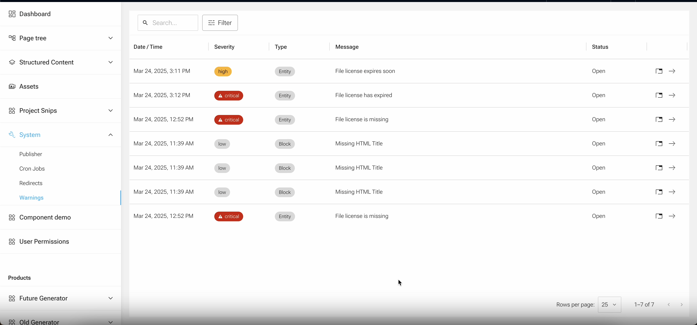

# Warning Module in Comet

The Warning Module helps find and report issues in your project.  
All warnings are shown in **one central place** inside a **grid in the admin panel**.

In this grid, you can:

- See **all warnings that concern you** (meaning you have the necessary permissions).
- Click on an action to **jump directly to the issue** and fix it.



Comet provides some built-in warnings, but you can also add your own in the project.

## Implementation Guide

New projects come with the Warning Module **already set up** by default.  
However, if your project does **not** have the Warning Module configured yet, you need to **register it manually**.

### 1. Register the Warning Module in `app.module.ts`

Add the module to the `imports` array:

```typescript
import { WarningModule } from "@comet/core";

@NgModule({
    imports: [
        WarningModule,
        // other modules...
    ],
})
export class AppModule {}
```

### 2. Add the Warnings Page to the Admin Menu

To make the warnings accessible in the admin panel, add the following entry to the masterMenu:

```typescript
{
    type: "route",
    primary: <FormattedMessage id="menu.warnings" defaultMessage="Warnings" />,
    route: {
        path: "/system/warnings",
        component: WarningsPage,
    },
    requiredPermission: "warnings",
}
```

## Predefined Warnings

The warning Module comes with some warnings out of the box.
For example, if an SEO block is missing an HTML title, it will show a warning.

## Custom Block Warnings

You can create your own warnings inside a block by adding a `warnings()` function.
This function should return a list of warnings when something is wrong.

Example:

```javascript
class YourBlockData extends BlockData {
    @BlockField({ nullable: true })
    title?: string;

    warnings(): BlockWarning[] {
    if (!this.title) {
        return [{ severity: "low", message: "missingTitle" }];
    }
    return [];
    }
}
```

## Custom Entity Warnings

You can also create warnings for entities.  
To do this, use the `@CreateWarning` decorator and connect it to a service that implements the `CreateWarningsServiceInterface`.

### How to create an entity warning:

1. **Add the `@CreateWarning` decorator** to your entity and pass in a service.
2. **Create a service** that implements the `CreateWarningsServiceInterface` to define the warning logic.

Example of the Entity:

```typescript
@CreateWarning(MyWarningService)
class MyEntity {
    title: string;
}
```

Example of the Service:

```typescript
class MyWarningService implements CreateWarningsServiceInterface {
    createWarnings(entity: MyEntity): EntityWarning[] {
        const warnings: EntityWarning[] = [];

        if (!entity.title) {
            warnings.push({ severity: "medium", message: "missingTitle" });
        }

        return warnings;
    }
}
```
