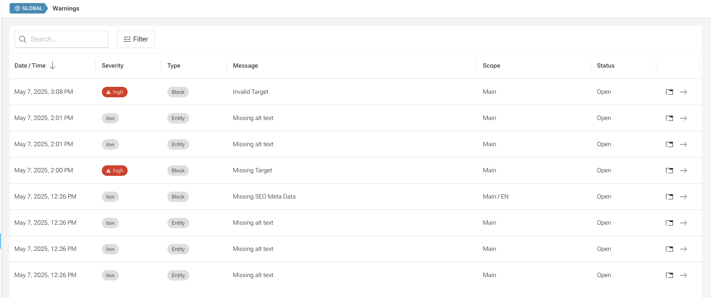

# Warning Module: Overview and Implementation Guide

The Warning Module helps find and report issues in the project.  
All warnings are shown in **one central place** inside a **grid in the admin panel**.

In this grid, you can:

- See **all warnings that concern you** (meaning you have the necessary scope permissions).
- Click on an action to **jump directly to the issue** and fix it.



The Warning Module operates through two main mechanisms:

1. **Daily Background Job**  
   A scheduled job runs once per day to check all warnings across the system.

2. **Real-time Updates**  
   Whenever a block or entity is modified, the system automatically checks warnings for that specific item.

This dual approach ensures both thorough checks through daily scans and immediate feedback when changes are made.

## Implementation Guide

New projects come with the Warning Module **already set up** by default.  
However, if your project does **not** have the Warning Module configured yet, you need to **register it manually**.

### 1. Register the Warning Module for the API in `app.module.ts`

Add the module to the `imports` array:

```typescript
import { WarningsModule } from "@comet/cms-api";

return {
    module: AppModule,
    imports: [
        // other modules...
        WarningsModule,
    ],
};
```

### 2. Add the Warnings Page to the Admin Menu

To make the warnings accessible in the admin panel, add the following entry to the masterMenu:

```typescript
{
    type: "route",
    primary: <FormattedMessage id="menu.warnings" defaultMessage="Warnings" />,
    route: {
        path: "/system/warnings",
        component: WarningsPage,
    },
    requiredPermission: "warnings",
}
```

### 3. Schedule the Daily Warning Check

To ensure warnings are checked regularly, schedule the following CLI command to run once per day:

```
npm run console check-warnings
```

It is recommended to schedule this job using a cronjob and run it during off-peak hours (such as at night) to minimize any impact on application performance. For more details on setting up cronjobs, see [Cron Jobs](/docs/features-modules/cron-jobs/).

:::info

The Warning Module comes with some built-in warnings out of the box.
For example, if a SEO block is missing an HTML title, it will show a warning.

:::

## API: Custom Block Warnings

You can define custom warnings for blocks by implementing a `warnings()` function in the API.  
This function should return a list of warnings based on specific conditions.

### Simple Block Warning

Example:

```typescript
class NewsBlockData extends BlockData {
    @BlockField({ nullable: true })
    title?: string;

    warnings(): BlockWarning[] {
        const warnings: BlockWarning[] = [];

        if (!this.title) {
            warnings.push({ severity: "low", message: "missingTitle" });
        }

        return warnings;
    }
}
```

### Block Warning with Dependency Injection

When you need dependency injection, you can also add your own WarningsService like that:

#### Example of the Block

```typescript
class NewsBlockData extends BlockData {
    @BlockField({ nullable: true })
    id?: string;

    warnings() {
        return NewsBlockWarningsService;
    }
}
```

#### Example of the Service

```typescript
@Injectable()
export class NewsBlockWarningsService implements BlockWarningsServiceInterface<NewsBlockData> {
    constructor(
        @InjectRepository(NewsRepository)
        private readonly newsRepository: EntityRepository<NewsRepository>,
    ) {}

    async createWarnings(block: NewsBlockData): Promise<BlockWarning[]> {
        const warnings: BlockWarning[] = [];

        if (block.id) {
            const news = await this.newsRepository.findOne({ id: block.id });
            if (!news) {
                warnings.push({ severity: "high", message: "invalidNewsTarget" });
            }
        } else {
            warnings.push({ severity: "high", message: "missingNewsTarget" });
        }
        return warnings;
    }
}
```

## API: Custom Entity Warnings

You can also create warnings for entities.  
To do this, use the `@CreateWarnings` decorator

### Simple Entity Warning

```typescript
@CreateWarnings<News>(async (value) => {
    if (!value.title) {
        return [
            {
                message: "missingTitle",
                severity: "low",
            },
        ];
    }
    return [];
})
@Entity()
class News {
    @Field({ nullable: true })
    @Property({ columnType: "text", nullable: true })
    title?: string;
}
```

### Entity Warning with dependency injection

#### Example of the Entity:

```typescript
@CreateWarnings(NewsWarningService)
@Entity()
class NewsPageType {
    @Field({ nullable: true })
    @Property({ columnType: "text", nullable: true })
    newsId?: string;
}
```

#### Example of the Service:

```typescript
class NewsWarningService implements CreateWarningsServiceInterface<NewsPageType> {
    constructor(
        @InjectRepository(News)
        private readonly newsRepository: EntityRepository<News>,
    ) {}

    async createWarnings(entity: MyEntity): Promise<EntityWarning[]> {
        const warnings: EntityWarning[] = [];

        if (entity.newsId) {
            const news = await this.newsRepository.findOne(entity.newsId);
            if (!news) {
                warnings.push({ severity: "high", message: "invalidNewsTarget" });
            }
        }

        return warnings;
    }
}
```

### Entity Warning for improved performance

When defining a warning with one of the above methods, performance issues may arise if your entity's database table contains numerous entries. In such cases, the `WarningService` provides a generator function `async *bulkCreateWarnings()` that allows for more efficient querying and checking of warnings.

Instead of checking all records (which happens with the regular `createWarnings` function), you can define specific criteria for which entities should be checked. For example, if you only need to check warnings for active `News` items (excluding archived ones), you can reduce the number of records to check.

Here's how to implement this:

```typescript
class NewsWarningService implements CreateWarningsServiceInterface {
    constructor(
        @InjectRepository(News)
        private readonly newsRepository: EntityRepository<News>,
    ) {}

    async *bulkCreateWarnings() {
        let offset = 0;
        const limit = 50;

        let news = [];
        do {
            news = await this.newsRepository.find(
                {
                    isArchived: false,
                },
                { limit, offset },
            );

            for (const entity of news) {
                if (!entity.title) {
                    yield {
                        warnings: [
                            {
                                message: "missingTitle",
                                severity: "low",
                            },
                        ],
                        targetId: news.id,
                        scope: news.scope,
                    };
                }
            }
            offset += limit;
        } while (news.length > 0);
    }
}
```

## Admin: Custom Block Warning Messages

In the API, you defined custom warning messages for your blocks or entities. To make these messages translatable in the Admin, you need to define them in your `App.tsx` using the `CometConfigProvider`:

```tsx
<CometConfigProvider
    {...otherConfigs}
    warnings: {
        messages: {
            missingTitle: <FormattedMessage id="warnings.missingTitle" defaultMessage="Title is missing" />
        }
    }
/>
```

This allows you to map your custom warning message keys to their translations using the `FormattedMessage` component. The keys used in the API (`missingTitle`, etc.) will be matched with these translations to display user-friendly messages in the admin interface.
