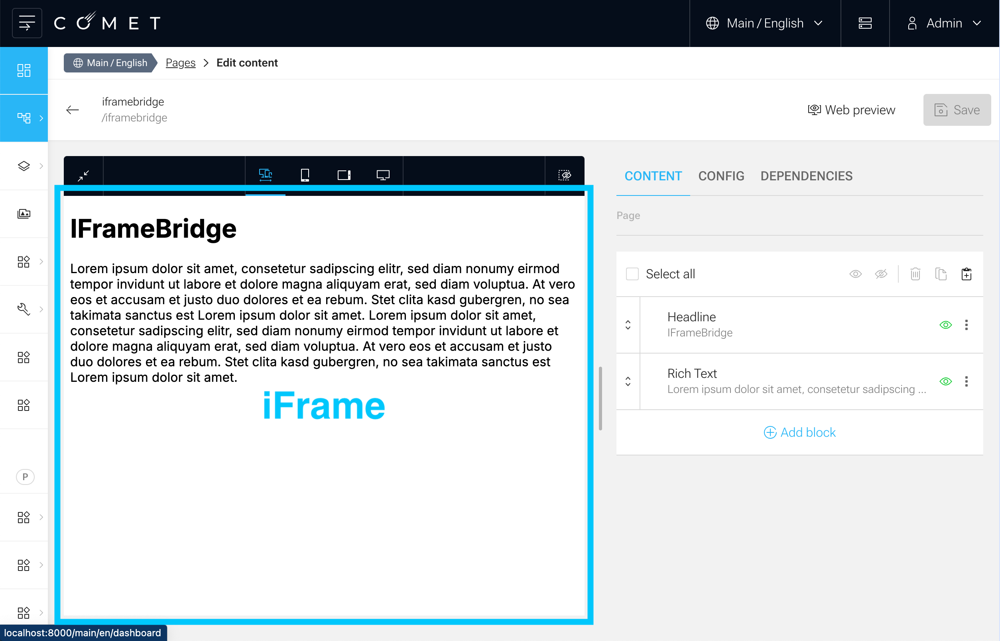

The Block Preview allows you to preview your blocks in the context of the Comet Admin. The Block Preview is an iframe that is embedded in the Comet Admin. Comet Admin is intended to be a headless CMS, but to offer the capability to render a preview of the content, the block-preview got introduced.



The `IFrameBridge` is a communication bridge between the Comet Admin and the Block Preview implemented in the client. It allows you to send messages from the Comet Admin to the Block Preview and vice versa. In the admin client the `IFrameBridge` is already implemented and can be used out of the box and is already sending messages to the iframe client's block preview. In the client you can use the IFrameBridge from `@comet/site-nextjs` to receive/send messages from/to the Comet Admin.

## IFrameMessages

There are several messages that can be sent between the Comet Admin and the Block Preview. All of them are handled or are available in a higher level api which is provided in the `useIFrameBridge` hook.

| Property                       | Sender | Description                                                                                                                                                                                                   | available                                           |
| ------------------------------ | ------ | ------------------------------------------------------------------------------------------------------------------------------------------------------------------------------------------------------------- | --------------------------------------------------- |
| `IReadyIFrameMessage`          | Site   | The Ready message is sent from the site to the admin when the iFrame is ready to receive messages.                                                                                                            | handled in `IFrameBridgeProvider`                   |
| `IFrameSelectComponentMessage` | Site   | The `IFrameSelectComponentMessage` is sent from the site to the admin when a component is selected in the iFrame. The admin interface will then try to navigate to the corresponding block's admin interface. | `iFrameBridge.sendSelectComponent("id")`            |
| `IFrameHoverComponentMessage`  | Site   | The `IFrameHoverComponentMessage` is sent from the site to the admin, when a component is hovered in the iFrame and should be highlighted in the admin interface.                                             | `iFrameBridge.sendHoverComponent("route")`          |
| `IFrameOpenLinkMessage`        | Site   | @deprecated                                                                                                                                                                                                   |
| `IFrameLocationMessage`        | Site   | @deprecated                                                                                                                                                                                                   |
| `IAdminBlockMessage`           | Admin  | The `IAdminBlockMessage` is sent from the admin to the site, which block should be displayed in the iFrame.                                                                                                   | `iFrameBridge.sendBlockState()`                     |
| `IAdminShowOnlyVisibleMessage` | Admin  | The `IAdminShowOnlyVisibleMessage` is sent from the admin to the site, indicating if hidden blocks should be rendered or not.                                                                                 | `iFrameBridge.sendShowOnlyVisible(true)`            |
| `IAdminSelectComponentMessage` | Admin  | The `IAdminSelectComponentMessage` is sent from the admin to the site, when a component is selected in the admin interface.                                                                                   | `iFrameBridge.sendSelectComponent("id")`            |
| `IAdminHoverComponentMessage`  | Admin  | The `IAdminHoverComponentMessage` is sent from the admin to the site, when a component is hovered in the admin interface.                                                                                     | `iFrameBridge.sendHoverComponent("id")`             |
| `IAdminContentScopeMessage`    | Admin  | The `IAdminContentScopeMessage` is sent from the admin to the site, when the content scope is changed in the admin interface.                                                                                 | `iFrameBridge.sendContentScopeJwt(contentScopeJwt)` |

## block-preview

To make the Block Preview embeddable in the Comet Admin, the client must provide an entry point where the client application renders the block preview and implements the `IFrameBridge` for communication. In a typical comet application the block preview is available at `site-domain.com/block-preview/page`

To Implement the `IFrameBridge` in any client, you can use `IFrameBridgeProvider` and `useIFrameBridge` from `@comet/site-nextjs`.

The `IFrameBridgeProvider` will already handle and prepare the communication between the Comet Admin and the Block Preview. The `useIFrameBridge` hook can be used to send messages from the Comet Admin and provide a higher level api for sending events to the admin.

```tsx

const PreviewPage = () => {
    const iFrameBridge = useIFrameBridge();
    return <div>{iFrameBridge.block ? <Block block={iFrameBridge.block} /> : "No Block available"}<div>;
}

const BlockPreview = () => {
    return <IFrameBridgeProvider>Block Preview</IFrameBridgeProvider>;
};
```

## `withPreview`

The client is responsible to implement the sending of the corresponding Events `sendSelectComponent` and `sendHoverComponent`.

`@comet/site-nextjs` offers a simple HOC where one can wrap a block with a `withPreview` HOC. The `withPreview` HOC will handle hover and select events and send them to the Comet Admin.

```tsx
import { PropsWithData, withPreview } from "@comet/site-nextjs";
import { SampleBlockData } from "@src/blocks.generated";

export const SampleBlock = withPreview(
    ({ data }: PropsWithData<SampleBlockData>) => {
        return <div>Sample Block {data.title}</div>;
    },
    { label: "Sample Block" },
);
```
