COMET DXP comes with a built-in preview system. There are two different types of preview: the site preview and the block preview.

## Block Preview

When editing a page, there is a live preview where you can immediately see changes and how they will look on the actual website.

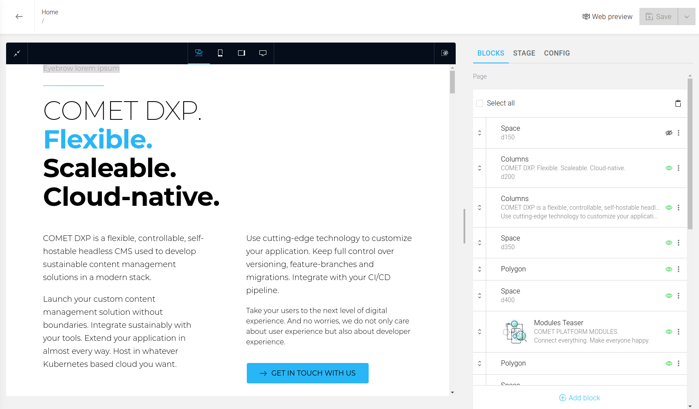

Additionally, there is a dark menu bar with buttons at the top of the preview.

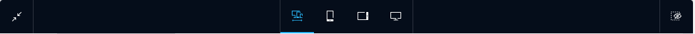

### Menu Bar Buttons {#menuBarButtons}

This button on the left minimizes the preview to leave more space for editing the blocks.

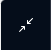

There is the "Show only visible blocks" on the right side"-Button. And as the name already implies, invisible blocks are not shown when activated.

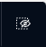

The list of buttons in the center of the bar offers the user different layout options. For example, the first button uses the full available screen size, while the second button limits the layout to a mobile layout for a phone. The third button is for a view on a mobile tablet layout, and the last one shows the web for a desktop PC.

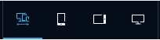

### Full-Layout

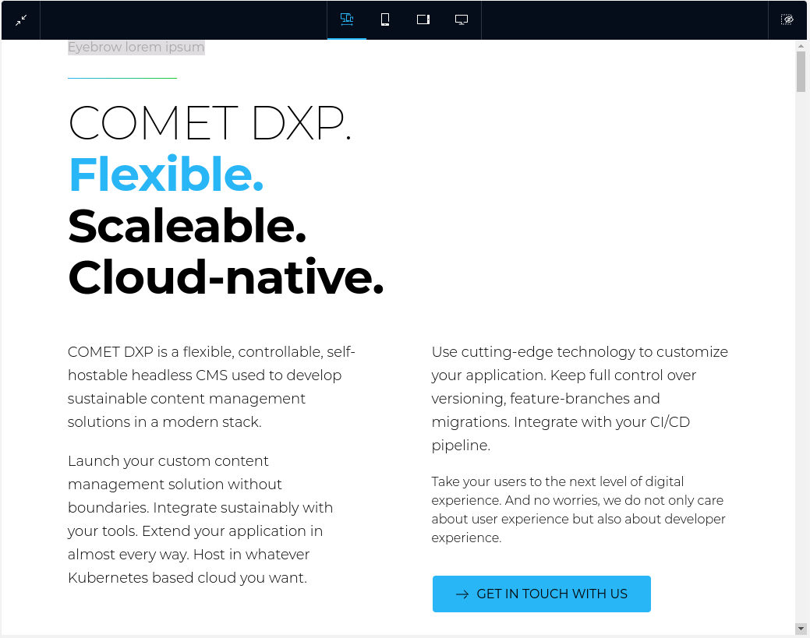

### Mobile-Phone-Layout

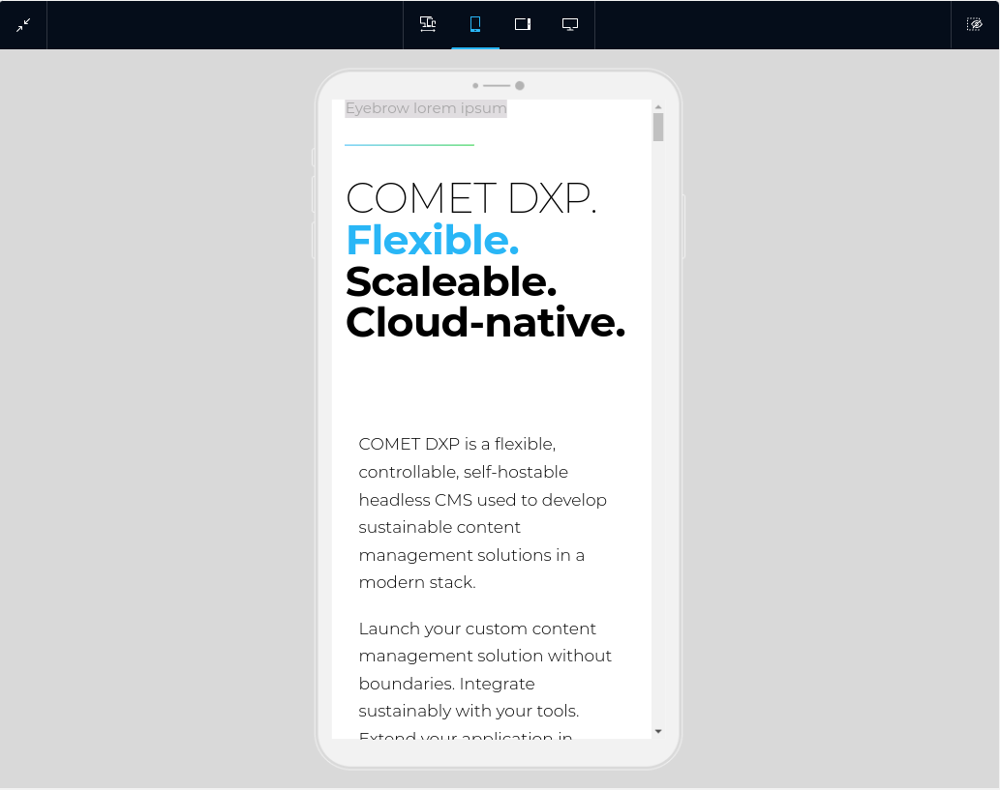

### Mobile-Tablet-Layout

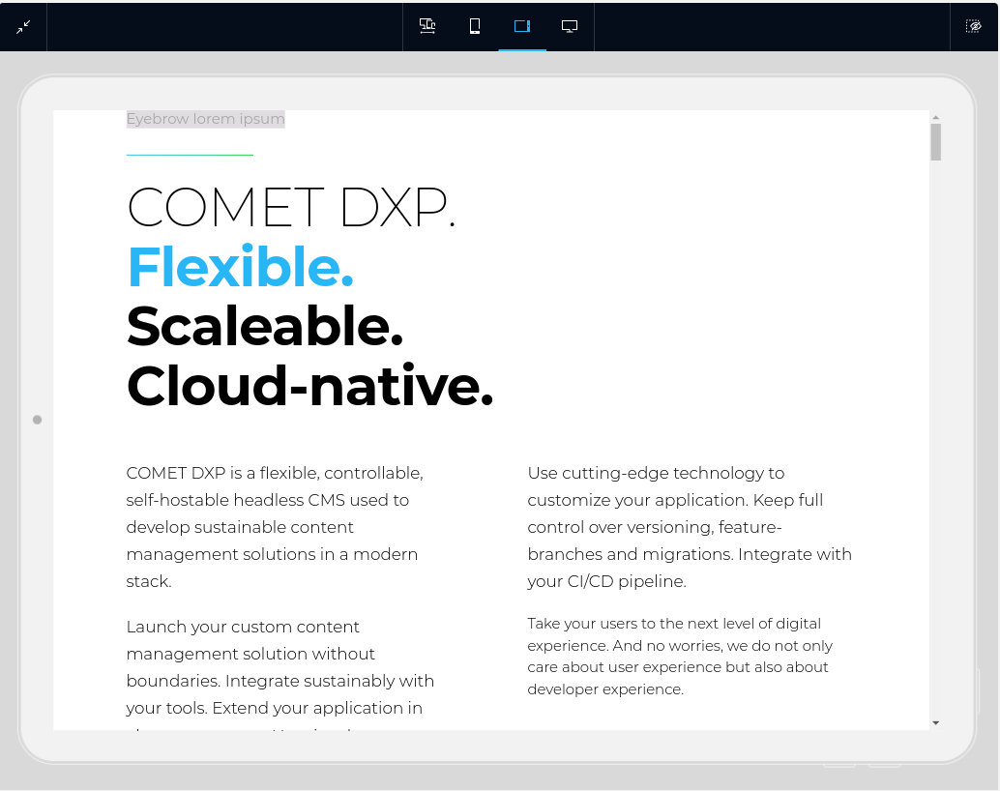

### Desktop-PC-Layout

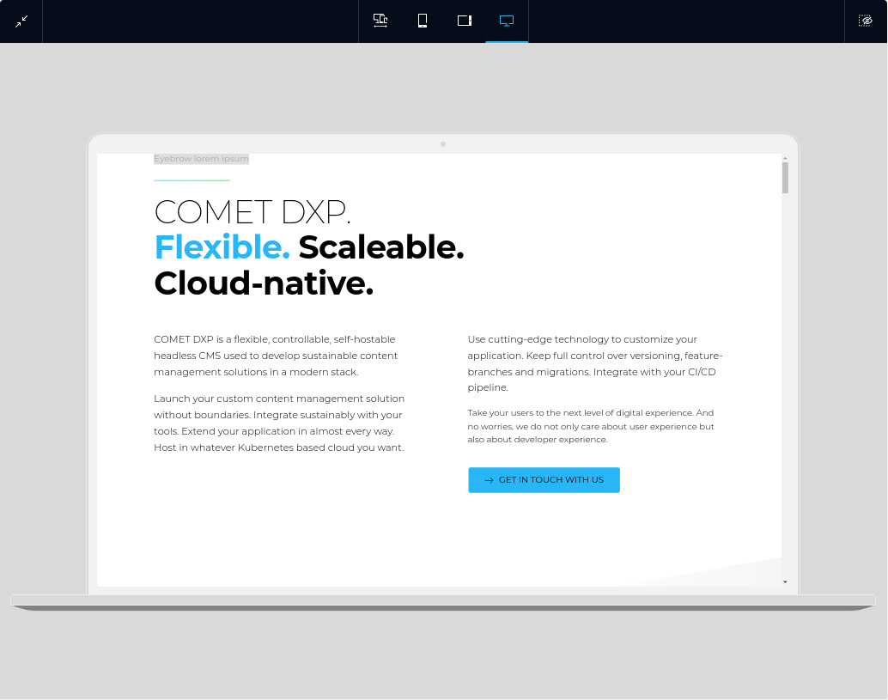

### Done! That's all the preview's menu bar has to offer

But there is another powerful feature!

### Hover

When you hover the mouse cursor over an element in the block list, the block receives a highlighting box. Furthermore, the preview automatically scrolls to the highlighted block.

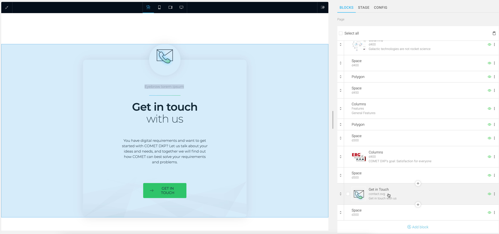

Additionally, you can hover over elements in the preview, and the block will be highlighted in the block list on the right.

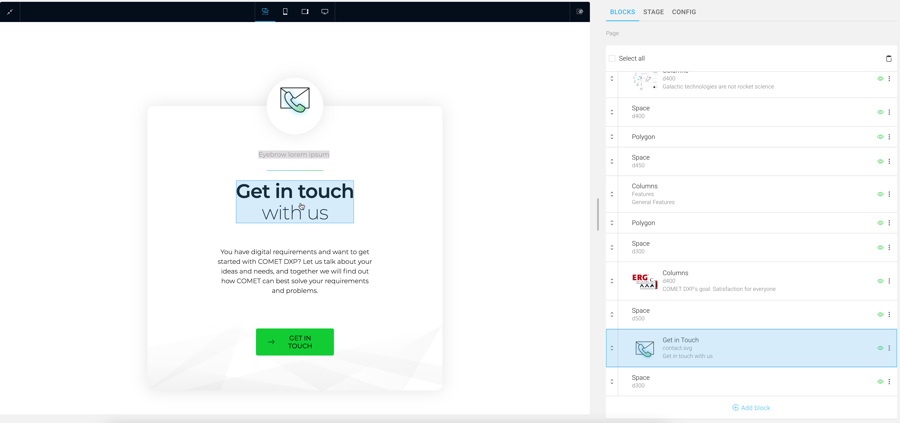

Blocks almost always consist of several elements. So if you want to edit one of them, click on it once with the left mouse button, and you can directly edit the selected element.

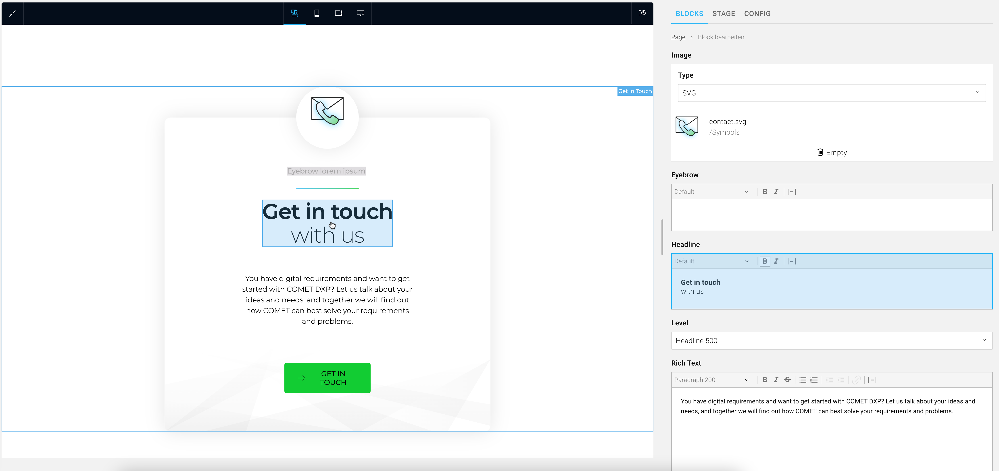

## Site preview

The site preview is an overview of the entire website in preview mode, as seen in the image below.

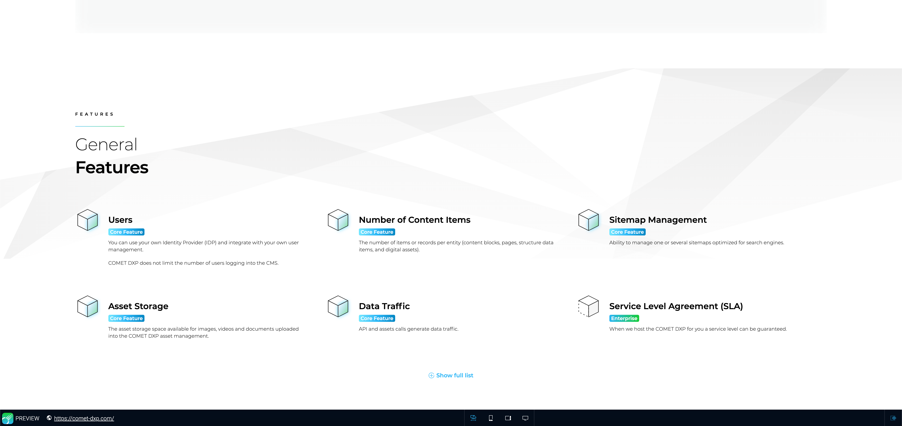

So what are the advantages of the site preview? The site preview is always live, while the current website may not be built yet. The menu bar in the site preview works just like the [menu bar in the block preview](#menuBarButtons). If you still want to view the website directly, you can find the URL to your website in the left area of the menu bar.

### Implementation

But what steps need to be taken to make the block preview work as described?

If you [followed the guide to create your first block](/docs/core-concepts/blocks/your-first-block), it already works!

In section "[Part three - Adding the block to the site](/docs/core-concepts/blocks/your-first-block#partThree)," the function `withPreview(...)` is wrapped around the block-specific code. So to get the preview working with all its features, simply wrap the `withPreview()` function over each block and give it an expressive label!

```tsx title="HeadlineBlock.tsx"
export const HeadlineBlock = withPreview(
    {
        /* Block-specific code */
    },
    { label: "Headline" },
);
```

### That's all it takes! We have taken care of everything else.

## Additional Implementation Details

### Manually opening the site preview

If you want to open the site preview at a particular place, you can do that with the following code:

```ts
import { openPreviewWindow } from "@comet/cms-admin";

function myCustomFunction() {
    const { scope, match } = useContentScope();
    openPreviewWindow("/my-custom-path/", match);
}
```

We recommend using the default icon for the preview button, which can be imported as follows:

```ts
import { Preview } from "@comet/admin-icons";
```

:::warning

Additional steps are required to use the preview with [structured data](../../core-concepts/structured-data), which will be covered by future versions of the documentation.

:::
