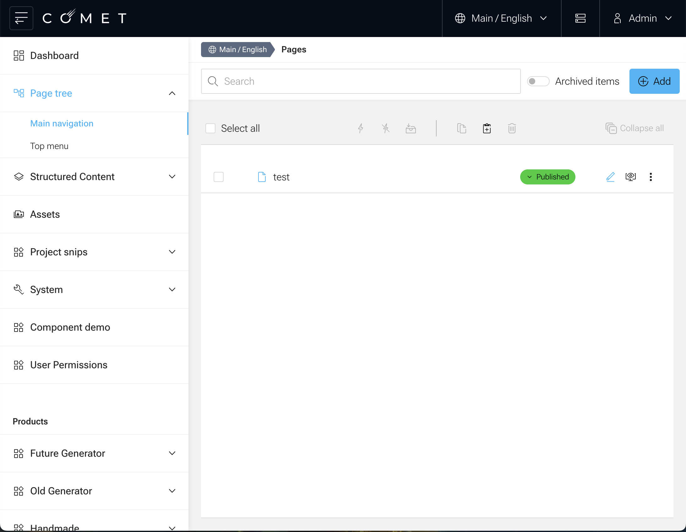
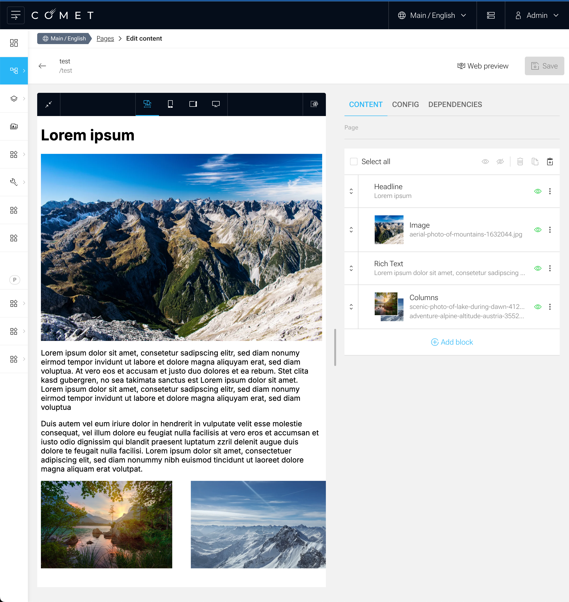
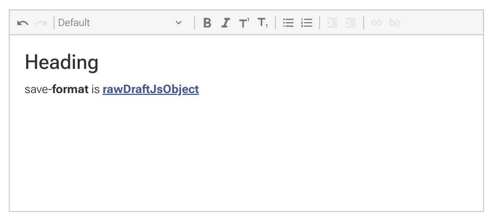
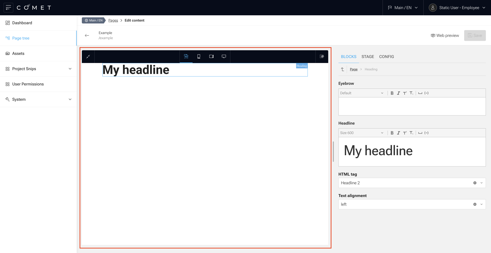

We usually use [Next.js](https://nextjs.org/) to build our site client.
This guide will show you how to build a custom client for your Comet DXP and render a typical content page from the page tree.

For this guide, we will assume you use React but not Next.js.
In this case, you can use the `@comet/site-react` package to build your custom client:

```bash
npm install @comet/site-react
```

## Loading documents (pages)

In COMET DXP, content is organized in a hierarchical tree structure called the **page tree**.
Each page tree node has a **document** attached to it, which can be a page, a link or other content types.

A sample page tree list can look like this:



### Page Tree Node List

To load/see all page tree nodes, you need to query the `pageTreeNodeList` field in the `Query` type.
This field allows you to fetch a list of `PageTreeNode` objects based on specific criteria such as `contentScope` and `category`.
These values differ from project to project and are defined by the project's requirements.
There is also another query, `paginatedPageTreeNodes`, which is more performant for large page trees.

The following query fetches all `PageTreeNode` objects and includes their id, name, path and slug:

```graphql
query Pages($contentScope: PageTreeNodeScopeInput!, $category: String!) {
    pageTreeNodeList(scope: $contentScope, category: $category) {
        id
        name
        path
        slug
    }
}
```

A response will then look similar to this:

```json
{
    "data": {
        "pageTreeNodeList": [
            {
                "id": "7c151a7f-7e0c-4103-8d34-216421f4cdcf",
                "name": "test",
                "path": "/test",
                "slug": "test"
            }
        ]
    }
}
```

With that information in place, we can now query the page content based on the PageTreeNode's id.

### Documents

In Comet DXP, documents are the content entities that can be attached to page tree nodes.
The documents depend on the project configuration and can vary widely.
The most common document type is the `Page`, which consists of **blocks** and represents one page of your website.

The following example show a content page that includes a `HeadlineBlock`, `ImageBlock`, `RichTextBlock`, and a `ColumnBlock` containing two `ImageBlock` elements:



#### Loading page data

As said before, we are working with page content attached to a page tree node.
The page tree is a tree structure that contains all the pages in the system.
Each page tree node has an `id` that can be used to fetch the page data from the API.

> **Note:** Blocks can also be attached to other data (e.g., structured data, news, ...). Loading and rendering will be similar, but also a bit different depending on the use case.

To fetch the corresponding data, we will make use of the `pageTreeNode` field in the `Query` type.
The `pageTreeNode` field returns a PageTreeNode object that contains the necessary page data.

```graphql title="graphql.schema"
type Query {
    pageTreeNode(id: ID!): PageTreeNode
}

type PageTreeNode {
    id: ID!
    path: String!
    document: PageContentUnion
}

union PageContentUnion = Page | Link # The PageContent Union can contain many more entries, we are focusing now on the Page type.
type Page implements DocumentInterface {
    id: ID!
    content: PageContentBlockData!
}

scalar PageContentBlockData
    @specifiedBy(url: "http://www.ecma-international.org/publications/files/ECMA-ST/ECMA-404.pdf")
```

To query the page data, we can use the following query:

```graphql
query Page($id: ID!) {
    pageTreeNode(id: $id) {
        id
        path
        document {
            ... on Page {
                content
            }
        }
    }
}
```

In situations where you don't have the id at hand, you can also query the page tree node based on its path using the `pageTreeNodeByPath` query:

```graphql
query Page {
    pageTreeNodeByPath(path: "/", scope: { domain: "main", language: "en" }) {
        id
        path
        document {
            ... on Page {
                content
            }
        }
    }
}
```

The received `content` is a Comet DXP `PageContentBlockData` Scalar and contains a **root block** which is basically a JSONObject that contains the block data.

<details>
<summary>Full Sample Response</summary>

```json
{
    "data": {
        "pageTreeNode": {
            "id": "7c151a7f-7e0c-4103-8d34-216421f4cdcf",
            "path": "/test",
            "document": {
                "content": {
                    "blocks": [
                        {
                            "key": "9d261397-6d62-4d6e-8934-0b627f4af4e4",
                            "visible": true,
                            "type": "headline",
                            "props": {
                                "eyebrow": "",
                                "headline": {
                                    "draftContent": {
                                        "blocks": [
                                            {
                                                "key": "8i42j",
                                                "text": "Lorem ipsum",
                                                "type": "unstyled",
                                                "depth": 0,
                                                "inlineStyleRanges": [],
                                                "entityRanges": [],
                                                "data": {}
                                            }
                                        ],
                                        "entityMap": {}
                                    }
                                },
                                "level": "header-one"
                            },
                            "userGroup": "All"
                        },
                        {
                            "key": "83a341d4-723c-422f-beea-5d3b1a31a10c",
                            "visible": true,
                            "type": "image",
                            "props": {
                                "attachedBlocks": [],
                                "block": {
                                    "type": "pixelImage",
                                    "props": {
                                        "damFile": {
                                            "id": "59d72281-9ae9-4351-b37b-6efc01a54842",
                                            "name": "aerial-photo-of-mountains-1632044.jpg",
                                            "size": "6412063",
                                            "mimetype": "image/jpeg",
                                            "contentHash": "4c16d34b98b993a8864a599cbbd419e0",
                                            "title": null,
                                            "altText": null,
                                            "archived": false,
                                            "scope": {
                                                "domain": "main"
                                            },
                                            "importSourceId": null,
                                            "importSourceType": null,
                                            "image": {
                                                "width": 6000,
                                                "height": 4000,
                                                "cropArea": {
                                                    "focalPoint": "SMART",
                                                    "width": null,
                                                    "height": null,
                                                    "x": null,
                                                    "y": null
                                                },
                                                "dominantColor": "#324f63"
                                            }
                                        },
                                        "urlTemplate": "http://localhost:4000/dam/images/067e080ba5e484cde929c866d5d26814bead1b58/59d72281-9ae9-4351-b37b-6efc01a54842/crop:SMART/resize:$resizeWidth:$resizeHeight/aerial-photo-of-mountains-1632044"
                                    }
                                },
                                "activeType": "pixelImage"
                            },
                            "userGroup": "All"
                        },
                        {
                            "key": "bdf6c7be-a1cc-4f83-85be-16a221d94eb2",
                            "visible": true,
                            "type": "richtext",
                            "props": {
                                "draftContent": {
                                    "blocks": [
                                        {
                                            "key": "9uhi2",
                                            "text": "Lorem ipsum ...",
                                            "type": "unstyled",
                                            "depth": 0,
                                            "inlineStyleRanges": [],
                                            "entityRanges": [],
                                            "data": {}
                                        },
                                        {
                                            "key": "adu0d",
                                            "text": "",
                                            "type": "unstyled",
                                            "depth": 0,
                                            "inlineStyleRanges": [],
                                            "entityRanges": [],
                                            "data": {}
                                        },
                                        {
                                            "key": "8t7f1",
                                            "text": "Lorem ipsum ...",
                                            "type": "unstyled",
                                            "depth": 0,
                                            "inlineStyleRanges": [],
                                            "entityRanges": [],
                                            "data": {}
                                        }
                                    ],
                                    "entityMap": {}
                                }
                            },
                            "userGroup": "All"
                        },
                        {
                            "key": "6f49d864-3225-4549-a539-0678f1c5195e",
                            "visible": true,
                            "type": "columns",
                            "props": {
                                "layout": "two-columns",
                                "columns": [
                                    {
                                        "key": "6d1e7395-f460-4c5a-9be5-b046dea61ad4",
                                        "visible": true,
                                        "props": {
                                            "blocks": [
                                                {
                                                    "key": "0b0fbb35-64cf-47e5-a28f-993c792be28a",
                                                    "visible": true,
                                                    "type": "image",
                                                    "props": {
                                                        "attachedBlocks": [],
                                                        "block": {
                                                            "type": "pixelImage",
                                                            "props": {
                                                                "damFile": {
                                                                    "id": "faac8d30-74ed-4818-9cdb-883ef3c3399f",
                                                                    "name": "scenic-photo-of-lake-during-dawn-4124074.jpg",
                                                                    "size": "5342794",
                                                                    "mimetype": "image/jpeg",
                                                                    "contentHash": "eb44dccb21566f10560b6650a7fd9de5",
                                                                    "title": null,
                                                                    "altText": null,
                                                                    "archived": false,
                                                                    "scope": {
                                                                        "domain": "main"
                                                                    },
                                                                    "importSourceId": null,
                                                                    "importSourceType": null,
                                                                    "image": {
                                                                        "width": 6000,
                                                                        "height": 4000,
                                                                        "cropArea": {
                                                                            "focalPoint": "SMART",
                                                                            "width": null,
                                                                            "height": null,
                                                                            "x": null,
                                                                            "y": null
                                                                        },
                                                                        "dominantColor": "#3f3e26"
                                                                    }
                                                                },
                                                                "urlTemplate": "http://localhost:4000/dam/images/8469b5607c52ad0a2f7760191812372072649a8e/faac8d30-74ed-4818-9cdb-883ef3c3399f/crop:SMART/resize:$resizeWidth:$resizeHeight/scenic-photo-of-lake-during-dawn-4124074"
                                                            }
                                                        },
                                                        "activeType": "pixelImage"
                                                    }
                                                }
                                            ]
                                        }
                                    },
                                    {
                                        "key": "65da0978-1f56-4d41-92e8-9404c30ca29a",
                                        "visible": true,
                                        "props": {
                                            "blocks": [
                                                {
                                                    "key": "427fb0a9-949d-46ce-a4f2-5438ec583cd8",
                                                    "visible": true,
                                                    "type": "image",
                                                    "props": {
                                                        "attachedBlocks": [],
                                                        "block": {
                                                            "type": "pixelImage",
                                                            "props": {
                                                                "damFile": {
                                                                    "id": "c87dafdf-d21c-4b1b-a956-9caf20434d2d",
                                                                    "name": "adventure-alpine-altitude-austria-355241.jpg",
                                                                    "size": "1739404",
                                                                    "mimetype": "image/jpeg",
                                                                    "contentHash": "b4622b2d3b71364a3d7d19e906136409",
                                                                    "title": null,
                                                                    "altText": null,
                                                                    "archived": false,
                                                                    "scope": {
                                                                        "domain": "main"
                                                                    },
                                                                    "importSourceId": null,
                                                                    "importSourceType": null,
                                                                    "image": {
                                                                        "width": 4608,
                                                                        "height": 2592,
                                                                        "cropArea": {
                                                                            "focalPoint": "SMART",
                                                                            "width": null,
                                                                            "height": null,
                                                                            "x": null,
                                                                            "y": null
                                                                        },
                                                                        "dominantColor": "#6883a1"
                                                                    }
                                                                },
                                                                "urlTemplate": "http://localhost:4000/dam/images/4cf3ef037210cc779fe257a70dd8079277e97cac/c87dafdf-d21c-4b1b-a956-9caf20434d2d/crop:SMART/resize:$resizeWidth:$resizeHeight/adventure-alpine-altitude-austria-355241"
                                                            }
                                                        },
                                                        "activeType": "pixelImage"
                                                    }
                                                }
                                            ]
                                        }
                                    }
                                ]
                            },
                            "userGroup": "All"
                        }
                    ]
                }
            }
        }
    }
}
```

</details>

### Blocks

The data in the `content` field is a so-called **root block**.
The `Page` document can have multiple root blocks.
Which root blocks are available depends on the page type and the configuration of the Comet DXP project.

Another root block, which is not requested in this example, would be the `seo` field.
This root block will contain all the necessary and available SEO information for the page in a block data structure.

The following JSON structure represents a `HeadlineBlock` in the page content. This block is used to display a headline with optional additional text (eyebrow) and a specific headline level:

Example:

```json
{
    "key": "9d261397-6d62-4d6e-8934-0b627f4af4e4",
    "visible": true,
    "type": "headline",
    "props": {
        "eyebrow": "",
        "headline": {
            "draftContent": {
                "blocks": [
                    {
                        "key": "8i42j",
                        "text": "Lorem ipsum",
                        "type": "unstyled",
                        "depth": 0,
                        "inlineStyleRanges": [],
                        "entityRanges": [],
                        "data": {}
                    }
                ],
                "entityMap": {}
            }
        },
        "level": "header-one"
    },
    "userGroup": "All"
}
```

**Block structure**

- `key`: A unique identifier for the block
- `visible`: A boolean indicating whether the block is visible
- `type`: The type of the block, in this case, "headline"
- `props`: An object containing the block-specific data:
    - `eyebrow`: An optional string for additional text above the headline
    - `headline`: An object containing the `draftContent`, which is a rich text structure
    - `level`: The level of the headline, e.g., "header-one"
- `userGroup`: Specifies the user group that can view the block, e.g., "All"

This block data structure is an example. The block data is very flexible and can look different depending on the block type and implementation in the project.

#### Special block types

There are some special block types, e.g. `BlocksBlock`, `ColumnsBlock`, `ListBlock`, `OneOfBlock`, `OptionalBlock`, `RichTextBlock` and more.
Since each block can have a different structure, we need to handle each block type individually and implement the rendering logic for each block type.
More information about these blocks and how to handle them can be found in the [block factories](/docs/core-concepts/blocks/factories) section.

#### Block metadata

The whole GraphQL API is type-safe, but the block data is delivered as an untyped JSON string.
This is because it is not possible to query recursive structures at an unknown depth in GraphQL.
Thus, Comet DXP offers **block metadata** to provide the necessary information about the block types and their structure.
This block metadata is stored in the `block-meta.json` file created by the Comet API.
`block-meta.json` is then symlinked to the `admin` and `site` services.

If the `api` is developed independently of the `site`, a symlink is not possible.
In this case, the `block-meta.json` must be provided via a separate API endpoint.

`@comet/cli` provides a command to generate the available TypeScript types based on a `block-meta.json` file:

```json title="package.json"
{
    "scripts": {
        "generate-block-types": "comet generate-block-types",
        "generate-block-types:watch": "chokidar -s \"block-meta.json\" -c \"npm run generate-block-types\""
    }
}
```

With these tools in place, TypeScript files can be generated for the block data, and will be placed in the `./src/blocks.generated.ts` directory:

```typescript title="blocks.generated.ts"
export interface PageContentBlockData {
    blocks: Array<{
        key: string;
        visible: boolean;
        type: string;
        props:
            | DemoSpaceBlockData
            | RichTextBlockData
            | HeadlineBlockData
            | DamImageBlockData
            | TextImageBlockData
            | LinkListBlockData
            | FullWidthImageBlockData
            | ColumnsBlockData
            | AnchorBlockData
            | TwoListsBlockData
            | MediaBlockData
            | TeaserBlockData
            | NewsDetailBlockData
            | ImageLinkBlockData
            | NewsListBlockData
            | LayoutBlockData;
        userGroup: "All" | "Admin" | "User";
    }>;
}

export interface HeadlineBlockData {
    eyebrow?: string;
    headline: RichTextBlockData;
    level: "header-one" | "header-two" | "header-three" | "header-four" | "header-five" | "header-six";
}

# and other block data interfaces
```

## Rendering blocks

Having the block data in place, we can now render the blocks.
The rendering logic for each block type is recommended to be implemented in a separate component.
You can find example implementations [in the demo project in the comet repository](https://github.com/vivid-planet/comet/tree/main/demo/site/src/common/blocks), e.g. the [HeadlineBlock](https://github.com/vivid-planet/comet/blob/a737ccc2f0826b236b49d63129a6a49e7f790993/demo/site/src/blocks/HeadlineBlock.tsx#L36) component.

The `@comet/site-react` package provides implementations for some important helper blocks:

- [BlocksBlock](/docs/core-concepts/blocks/factories#site-blocksblock)
- [ListBlock](/docs/core-concepts/blocks/factories#site-listblock)
- [OneOfBlock](/docs/core-concepts/blocks/factories#site-oneofblock)
- [OptionalBlock](/docs/core-concepts/blocks/factories#site-optionalblock)

Once you have implemented the block components, you can use them to render the blocks in your page content.

Usually, a `Page` document has a `content` root block that is a `BlocksBlock` containing all the blocks of the page.
This `BlocksBlock` is a special block that can render other blocks based on their type and data.
It should be implemented like this:

```typescript
import { BlocksBlock, PropsWithData, SupportedBlocks } from "@comet/site-react";
import { PageContentBlockData } from "@src/blocks.generated";

const supportedBlocks: SupportedBlocks = {
    heading: (props) => <HeadlineBlock data={props} />,
};

export const PageContentBlock = ({ data }: PropsWithData<PageContentBlockData>) => {
    return <BlocksBlock data={data} supportedBlocks={supportedBlocks} />;
};
```

### Handling images

In COMET DXP, we support pixel images and SVGs.
These must be handled differently.
We use a OneOfBlock to achieve this, which allows us to render either a pixel image or an SVG based on the block data.

The SVG block is relatively simple and is provided by the `@comet/site-react` package as `SvgImageBlock`.

The PixelImageBlock is a bit more complex because pixel images are automatically optimized by our ImgProxy.
The API returns a **url template** that can be used to generate the image URL with the desired width and height.
You must implement the `PixelImageBlock` yourself, but the `@comet/site-react` package provides helper methods to generate the image URL based on the block data:

- `generateImageUrl`: Takes the url template, width and aspect ratio and returns the actual image URL
- `parseAspectRatio`: Converts an aspect ratio string (e.g., "16:9") or number into a number representing the aspect ratio (e.g., 1.7777777777777777 for "16:9")
- `calculateInheritAspectRatio`: Takes the width, height and cropping settings of an image and calculates the aspect ratio
- `getMaxDimensionsFromArea`: Calculates the maximum width and height of the rendered image based on the width, height and aspect ratio

The urlTemplate returned by the API is either an absolute URL (default) or a relative URL.
This depends on the `x-relative-dam-urls` sent by the site.
**We recommend using relative URLs and rewriting the URLs to the API url in your site** for SEO optimization.

You can use the [implementation of PixelImageBlock for Next.js in the COMET Demo](https://github.com/vivid-planet/comet/blob/ede41201abfb664191fe286a58c46b0f053ebfd5/packages/site/site-nextjs/src/blocks/PixelImageBlock.tsx) as a reference.

### Handling rich text

In COMET DXP we use the rich text editor [Draft.js](https://draftjs.org/) to handle rich text content.
We persist the rich text content in the raw Draft.js object format, which is a JSON object containing blocks and entity map.

<details>

<summary>Sample Raw Draft.js Object</summary>



```json
{
    "blocks": [
        {
            "key": "3v61q",
            "text": "Heading",
            "type": "header-two",
            "depth": 0,
            "inlineStyleRanges": [],
            "entityRanges": [],
            "data": {}
        },
        {
            "key": "3t24s",
            "text": "save-format is rawDraftJsObject",
            "type": "unstyled",
            "depth": 0,
            "inlineStyleRanges": [
                {
                    "offset": 5,
                    "length": 6,
                    "style": "BOLD"
                },
                {
                    "offset": 15,
                    "length": 16,
                    "style": "BOLD"
                }
            ],
            "entityRanges": [
                {
                    "offset": 15,
                    "length": 16,
                    "key": 0
                }
            ],
            "data": {}
        },
        {
            "key": "7cbdf",
            "text": "",
            "type": "unstyled",
            "depth": 0,
            "inlineStyleRanges": [],
            "entityRanges": [],
            "data": {}
        }
    ],
    "entityMap": {
        "0": {
            "type": "LINK",
            "mutability": "MUTABLE",
            "data": {
                "url": "https://www.google.com"
            }
        }
    }
}
```

</details>

To render this rich text content in the site, you can use the [redraft](https://www.npmjs.com/package/redraft) package.
This package allows you to define renderers for inline styles, blocks and entities within the rich text content.
You can look at [the implementation in the COMET Demo](https://github.com/vivid-planet/comet/blob/904ff5f1d68bbfeb233c57f6fcb1dc05cc559c9b/demo/site/src/common/blocks/RichTextBlock.tsx) for an example of how this can be done.

## Implementing the block preview

The block preview allows you to preview blocks rendered by the site in the admin interface:



### `/block-preview` route

To implement the block preview, you need to provide a `/block-preview` route in your site.
This route needs to accept multiple url parameters and could look like this:

> `block-preview/:domain/:language/:type`

The `domain` and `language` parameters represent the dimensions of the content scope.
The content scope depends on the project configuration and can vary widely.

The `type` parameter represents the root block type to render, e.g., `content` or `stage`.
The available root block types also depend on the project configuration and can vary widely.

### Block preview page

The page rendered under `/block-preview` must be wrapped in the `IFrameBridgeProvider` and `BlockPreviewProvider`:

```tsx
import { BlockPreviewProvider, IFrameBridgeProvider } from "@comet/site-react";

export default function IFrameBridgeBlockPreviewPage(props: Route.ComponentProps) {
    return (
        <IFrameBridgeProvider>
            <BlockPreviewProvider>
                <BlockPreviewPage {...props} />
            </BlockPreviewProvider>
        </IFrameBridgeProvider>
    );
}
```

The `BlockPreviewPage` could look something like this:

```tsx
const types: Record<string, { component: ComponentType<any>; blockType: string }> = {
    page: {
        component: PageContentBlock,
        blockType: "PageContent",
    },
};

function BlockPreviewPage({ params }: Route.ComponentProps) {
    const blockType = types[params.type];
    const iFrameBridge = useIFrameBridge();

    return <div>{iFrameBridge.block && <blockType.component data={iFrameBridge.block} />}</div>;
}
```

It needs to use the `useIFrameBridge` hook to access the block data sent from the admin interface.
It also needs to match the `type` parameter to a root content block component to render.

### Making the blocks preview-ready

All block implementations in the site should be wrapped in the `withPreview` higher-order component (HOC) from the `@comet/site-react` package:

```tsx
import { withPreview } from "@comet/site-react";

export const HeadingBlock = withPreview(
    ({ data: { eyebrow, headline, htmlTag } }: HeadingBlockProps) => {
        // Render the block content
    },
    { label: "Heading" },
);
```

The `withPreview` HOC will ensure that the connection between the block and the admin interface works correctly in the block preview.
For example, when hovering a block in the admin blocklist, the block preview will scroll to and highlight the corresponding block in the site.
This also works the other way around: When clicking a block in the site, the admin interface will open the block in the admin interface.
The `withPreview` HOC is not required for the block preview to work, but it is highly recommended to ensure a smooth user experience.

Note: `withPreview` prevents implementing blocks as React Server Components (RSC)

More information on how to integrate and work with COMET's block preview can be found in the [IFrameBridge section](/docs/features-modules/preview/iframebridge/).

## Further Reading / Information

- [Comet Starter - Next Site - Blueprint for new Comet Projects](https://github.com/vivid-planet/comet-starter/tree/main/site)
- [Comet Starter - Page Tree Node Query](https://github.com/vivid-planet/comet-starter/blob/main/site/src/documents/pages/Page.tsx)
- [Comet Starter - Rendering blocks with Blocks Block](https://github.com/vivid-planet/comet-starter/blob/main/site/src/documents/pages/blocks/PageContentBlock.tsx)
