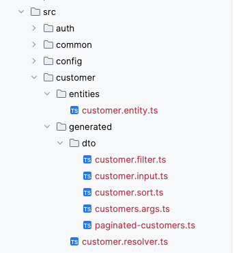
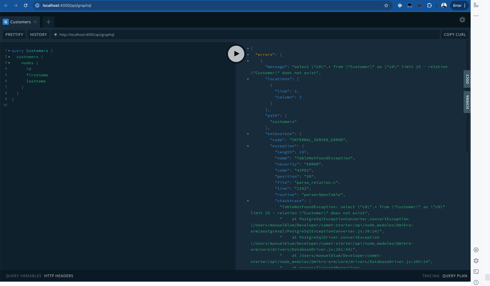

## Generating an entity with the api-generator

Since we are building the API first, we will start by generating a new entity. Go into the `api` folder and create a new directory, e.g., `api/src/customer`. Inside this directory, create a new file `customer.entity.ts` with the following content:

```typescript
import { CrudField, CrudGenerator } from "@comet/cms-api";
import { BaseEntity, Entity, PrimaryKey, Property } from "@mikro-orm/core";
import { Field, ID, ObjectType } from "@nestjs/graphql";
import { v4 } from "uuid";

@Entity()
@ObjectType()
@CrudGenerator({ targetDirectory: `${__dirname}/../generated/`, requiredPermission: "customer" })
export class Customer extends BaseEntity<Customer, "id"> {
    @CrudField({ search: true, filter: true, sort: true, input: false })
    @Field(() => ID)
    @PrimaryKey({ columnType: "uuid" })
    id: string = v4();

    @CrudField({ search: true, filter: false, sort: false, input: true })
    @Field()
    @Property({ columnType: "text" })
    firstname: string;

    @CrudField({ search: true, filter: false, sort: false, input: true })
    @Field()
    @Property({ columnType: "text" })
    lastname: string;

    @CrudField({ search: false, filter: false, sort: false, input: false })
    @Property({ onUpdate: () => new Date() })
    @Field()
    updatedAt?: Date = new Date();
}
```

Currently, there is no `api-generator` watch mode - so everytime you change the entity following command must be run. Information how to setup API Generato can be found [Setup API Generator](../../../1-getting-started/4-crud-generator/1-api-generator.md) Section.

```bash
cd api
npm run api-generator 
```

The **API Generator** will generate multiple files inside the specified `../generated` output directory. It will contain a `customer.resolver.ts` and some dto related files (`customer.filter.ts`, `customer.input.ts`, `customer.sort.ts`, `customer.args.ts`, `paginagted-customer.ts`).



To integrate the new entity into the application, you have to add a new NestJS module. Create a new file `customer.module.ts` in the `api/src/customer` directory with the following content:

```typescript
import { MikroOrmModule } from "@mikro-orm/nestjs";
import { Module } from "@nestjs/common";

import { Customer } from "./entities/customer.entity";
import { CustomerResolver } from "./generated/customer.resolver";

@Module({
    imports: [MikroOrmModule.forFeature([Customer])],
    providers: [CustomerResolver],
})
export class CustomerModule {}
```

This generated module must be added to the `api/src/app.module.ts` and registered proprietly.

```typescript
import { DynamicModule, Module } from "@nestjs/common";
import { CustomerModule } from "@src/customer/customer.module";
import { DbModule } from "@src/db/db.module";
import { ContentScope as BaseContentScope } from "@src/site-configs";

import { Config } from "./config/config";
import { ConfigModule } from "./config/config.module";

@Module({})
export class AppModule {
    static forRoot(config: Config): DynamicModule {
        return {
            module: AppModule,
            imports: [ConfigModule.forRoot(config), DbModule, CustomerModule],
        };
    }
}

//...
```

As soon the new `CustomerModule` is registered in the app module, the schema will update, and provide the new generated Queries/Mutations, including the Object types and necessary inputs


```graphql
type Customer {
    id: ID!
    firstname: String!
    lastname: String!
    updatedAt: DateTime!
}

type PaginatedCustomers {
    nodes: [Customer!]!
    totalCount: Int!
}

input CustomerFilter {
    id: StringFilter
    and: [CustomerFilter!]
    or: [CustomerFilter!]
}

input CustomerSort {
    field: CustomerSortField!
    direction: SortDirection! = ASC
}

enum CustomerSortField {
    id
}

type Query {
    # ...
    customer(id: ID!): Customer!
    customers(offset: Int! = 0, limit: Int! = 25, search: String, filter: CustomerFilter, sort: [CustomerSort!]): PaginatedCustomers!
}

input CustomerInput {
    firstname: String!
    lastname: String!
}

input CustomerUpdateInput {
    firstname: String
    lastname: String
}


type Mutation {
    # ...
    createCustomer(input: CustomerInput!): Customer!
    updateCustomer(id: ID!, input: CustomerUpdateInput!): Customer!
    deleteCustomer(id: ID!): Boolean!
}

```

Schema should already be available when you start the GraphQL Playground locally `http:4000/api/graphql`, and you should be able to play around with the queries.



As soon as you start to execute the first Query, one will see that @mikro-orm will through an error, that the Customer Table does not exists in the Database.


