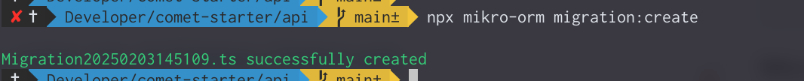
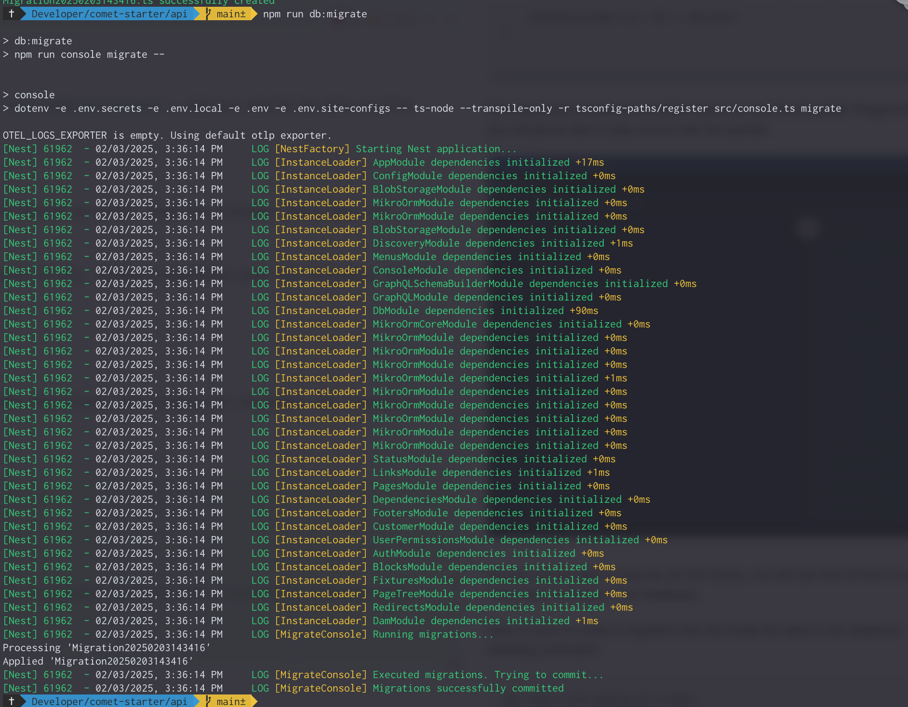
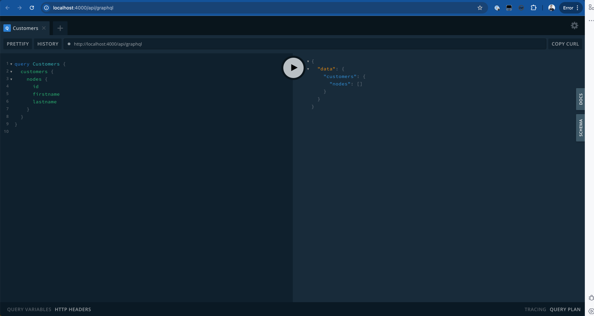

Now it's time to create a simple migration that will create an empty table in the database for the newly created Customer entity. First of all, create a migration with the following command:

```
npx mikro-orm migration:create
```



Mikro ORM will create a Migrations file in the `api/migrations` directory. Revise the migrations and clean unnecessary SQL statements. The migrations to create the Customer table should then look something like:

```typescript
import { Migration } from "@mikro-orm/migrations";

export class Migration20250203143416 extends Migration {
    async up(): Promise<void> {
        this.addSql(
            'create table "Customer" ("id" uuid not null, "firstName" text not null, "lastName" text not null, "updatedAt" timestamptz(0) not null, constraint "Customer_pkey" primary key ("id"));',
        );
    }
}
```

More info concerning MikroORM and the related CLI can be found here [MikroORM - Using via CLI](https://mikro-orm.io/docs/migrations#using-via-cli).

To execute the migration and insert the data in the database, run the following command:

```bash
npm run db:migrate
```



Now we are ready to execute the Query again in the GraphQL Playground, and one should see that the Query is executed successfully.


