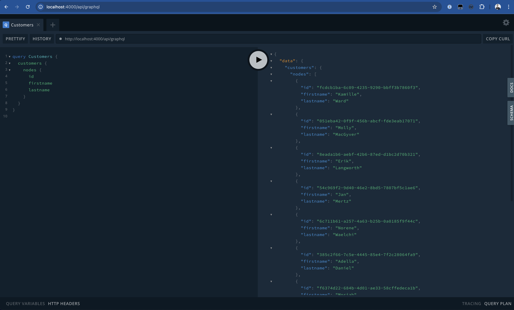

To insert some data into the database, we will use fixtures. Fixtures are a way to insert data into the database. The fixtures are defined in the `db/fixtures/generators` directory in the `api` directory. To generate fixtures, it's often useful to generate a lot of data. [@faker-js/faker](https://github.com/faker-js/faker) is often a good choice for generating a lot of random data.

## Create Fixtures

Create a new service in the `fixtures/generators` directory with the following content:

```ts title="customers-fixture.service.ts"
import { faker } from "@faker-js/faker";
import { InjectRepository } from "@mikro-orm/nestjs";
import { EntityManager, EntityRepository } from "@mikro-orm/postgresql";
import { Injectable, Logger } from "@nestjs/common";
import { Customer } from "@src/customers/entities/customer.entity";

@Injectable()
export class CustomersFixtureService {
    private logger = new Logger(CustomersFixtureService.name);

    constructor(
        private readonly entityManager: EntityManager,
        @InjectRepository(Customer) private readonly repository: EntityRepository<Customer>,
    ) {}

    async generate(): Promise<void> {
        this.logger.log("Generating customers...");

        for (let i = 0; i < 100; i++) {
            const customer = this.repository.create({
                id: faker.string.uuid(),
                firstName: faker.person.firstName(),
                lastName: faker.person.lastName(),
            });

            this.entityManager.persist(customer);
        }
    }
}
```

## Add Fixtures to the FixturesCommand

Additionally, the created fixtures must be executed.
Open `db/fixtures/fixtures.command.ts` and call the service:

```typescript
export class FixturesCommand extends CommandRunner {
    constructor(
        //...
        private readonly customersFixtureService: CustomersFixtureService,
    ) {
        super();
    }

    async run(): Promise<void> {
        //...

        await this.customersFixtureService.generate();

        await this.orm.em.flush();
    }
}
```

## Execute Fixtures

Everything should be set up now. To execute the fixtures, run the following command:

```bash
cd api
npm run fixtures
```

## Verify Fixtures

Now we are ready to execute the Query again in the GraphQL Playground, and one should see that the Query is executed successfully and will return the generated Data.


