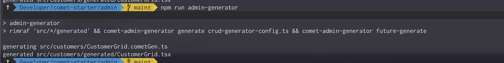
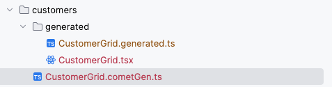
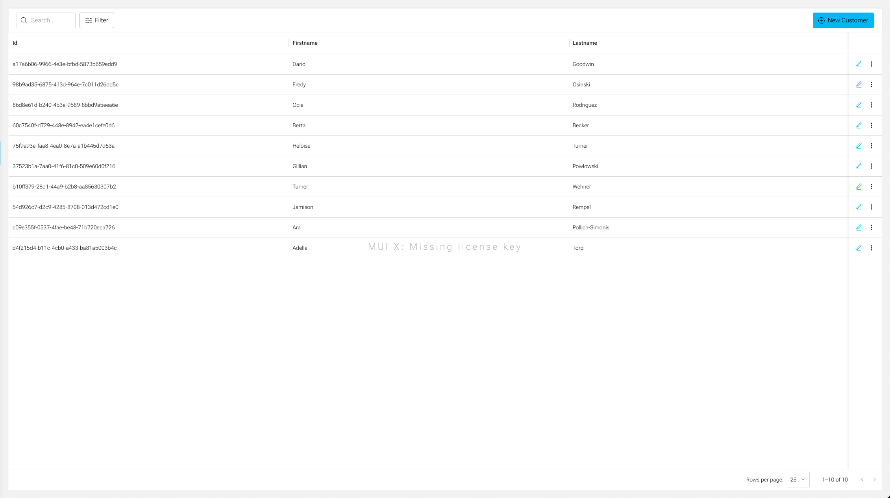

The Admin Generator is a powerful tool to generate a complete CRUD interface for your entities. We will show you how to create a DataGrid with the Admin Generator.

## Generate DataGrid

To generate a DataGrid with the Admin Generator, you have to create a `.cometGen.ts` file. Those files are used by the Admin Generator to generate different kinds of interfaces (DataGrids or Forms). Create a new file `CustomerGrid.cometGen.ts` in the `admin/src/customer` directory with the following content:

```typescript
import { future_GridConfig as GridConfig } from "@comet/cms-admin";
import { GQLCustomer } from "@src/graphql.generated";

export const CustomerGrid: GridConfig<GQLCustomer> = {
    type: "grid",
    gqlType: "Customer",
    columns: [
        { type: "text", name: "id" },
        { type: "text", name: "firstName" },
        { type: "text", name: "lastName" },
    ],
};
```

The `@comet/cms-admin` has types available for all the different components that can be generated. The `GridConfig` type is used to define the configuration of the DataGrid. The `GQLCustomer` got created in the section before, with the crud generator. The `GQLCustomer`
type is the GraphQL type that will be used to guarantee type safety. The `columns` array defines the columns of the DataGrid. Each column has a `type`, `name`, and other properties.

## Run Admin Generator

Unfortunately, there is no watch mode available for the Admin Generator. To generate the DataGrid, you have to run the Admin Generator manually. This will delete all already generated files and generate them again.

Run the following command:

```bash
cd admin
npm run admin-generator
```

The `admin-generator` script is configured in `admin/package.json` and will execute the admin generator binary.



Two files will be generated in the `admin/src/customers/generated` directory. The `CustomerGrid.tsx` and the `CustomerGrid.generated.ts`. The `CustomerGrid.tsx` is the React component that will render the DataGrid. The `CustomerGrid.generated.ts` has related types and interfaces from the GraphQL Api.



The component is ready to be used in the application. Simply use the generated component somewhere in your React Application:

`src/customers/CustomerPage.tsx`

```typescript
import { StackMainContent } from "@comet/admin";
import { CustomersGrid } from "@src/customers/generated/CustomerGrid";
import { FunctionComponent } from "react";

export const CustomerPage: FunctionComponent = () => {
    return (
        <StackMainContent fullHeight>
           <CustomersGrid />
        </StackMainContent>
    );
};
```

The generated CustomerGrid will look like this:


