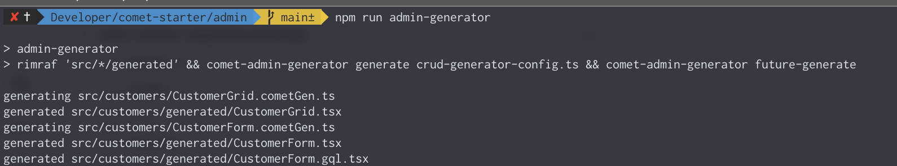
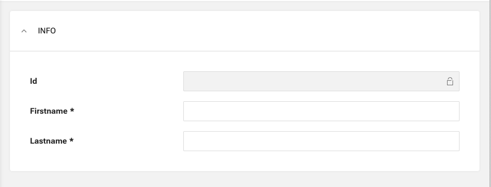

The Admin Generator can also generate Form Views.

## Generate Form

To generate a Form with the Admin Generator, you have to create a `.cometGen.ts` file. Those files are used by the Admin Generator to generate different kinds of interfaces (DataGrids or Forms). Create a new file `CustomerForm.cometGen.ts` in the `admin/src/customer` directory with the following content:

```typescript
import { future_FormConfig as FormConfig } from "@comet/cms-admin";
import { GQLCustomer } from "@src/graphql.generated";

export const CustomerForm: FormConfig<GQLCustomer> = {
    type: "form",
    gqlType: "Customer",
    mode: "all",
    fields: [
        {
            type: "fieldSet",
            name: "info",
            collapsible: false,
            fields: [
                {
                    type: "text",
                    name: "id",
                    readOnly: true,
                },
                {
                    type: "text",
                    name: "firstName",
                },
                {
                    type: "text",
                    name: "lastName",
                },
            ],
        },
    ],
};
```

## Run Admin Generator

Same as with the DataGrid generation, to generate the Form, you have to run the Admin Generator manually. This will delete all already generated files and generate them again.

```bash
cd admin
npm run admin-generator
```



The component is ready to be used in the application. Simply use the generated component `<CustomerForm />` somewhere in your React Application. An optional prop `id` also gets generated.

Sample Form will look like:



The CustomerForm can be configured for "add" or "edit" mode. In this case, the `add` mode will be the default behavior. As soon as the `id` is set on the Form, the Form will switch to `edit` mode.
