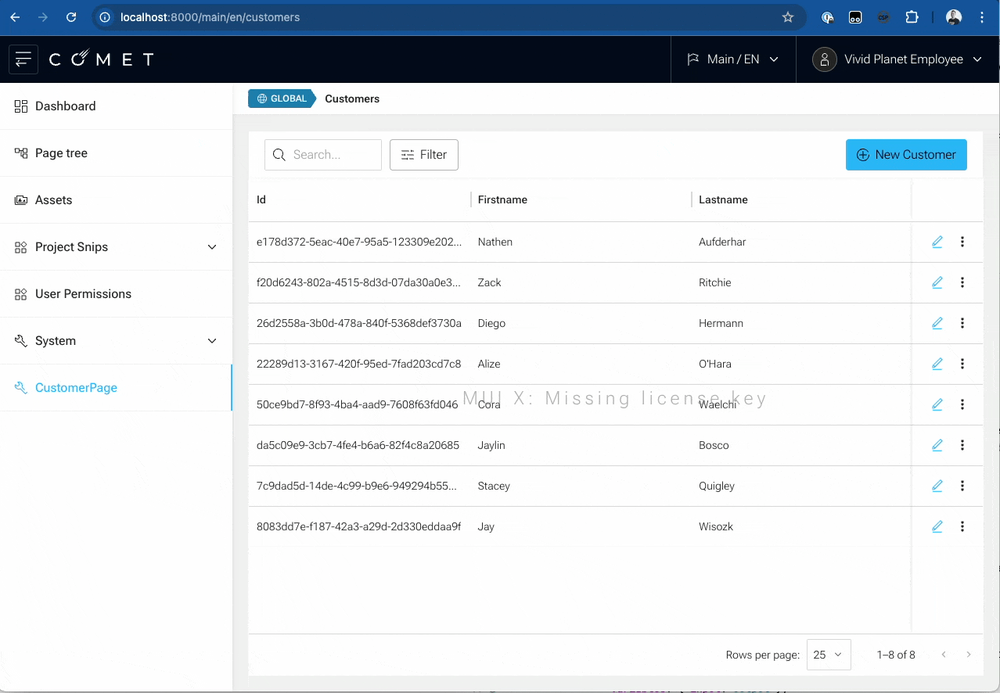

At the end of this guide, we want to combine the generated `CustomerGrid` with the `CustomerForm` into a new page, `CustomerPage`.

The `CustomerPage` will be a simple page that contains the `CustomerGrid`, the `CustomerForm`, and the related components from `@comet/admin` to seamlessly integrate into a Comet Application.

## Create CustomerPage

`src/customers/CustomerPage.tsx`

```typescript
import {
    Button,
    FillSpace,
    MainContent,
    SaveBoundary,
    SaveBoundarySaveButton,
    Stack,
    StackLink,
    StackMainContent,
    StackPage,
    StackSwitch,
    StackToolbar,
    ToolbarActions,
    ToolbarAutomaticTitleItem,
    ToolbarBackButton,
} from "@comet/admin";
import { Add, Edit } from "@comet/admin-icons";
import { ContentScopeIndicator } from "@comet/cms-admin";
import { IconButton } from "@mui/material";
import { CustomerForm } from "@src/customers/generated/CustomerForm";
import { CustomersGrid } from "@src/customers/generated/CustomerGrid";
import { FunctionComponent } from "react";
import { FormattedMessage } from "react-intl";

const FormToolbar = () => (
    <StackToolbar scopeIndicator={<ContentScopeIndicator global />}>
        <ToolbarBackButton />
        <ToolbarAutomaticTitleItem />
        <FillSpace />
        <ToolbarActions>
            <SaveBoundarySaveButton />
        </ToolbarActions>
    </StackToolbar>
);

export const CustomerPage: FunctionComponent = () => {
    return (
        <Stack topLevelTitle={<FormattedMessage id="customers" defaultMessage="Customers" />}>
            <StackSwitch>
                <StackPage name="grid">
                    <StackToolbar scopeIndicator={<ContentScopeIndicator global />} />

                    <StackMainContent fullHeight>
                        <CustomersGrid
                            toolbarAction={
                                <Button responsive startIcon={<Add />} component={StackLink} pageName="add" payload="add">
                                    <FormattedMessage id="customers.newCustomer" defaultMessage="New Customer" />
                                </Button>
                            }
                            rowAction={(params) => (
                                <IconButton color="primary" component={StackLink} pageName="edit" payload={params.row.id}>
                                    <Edit />
                                </IconButton>
                            )}
                            actionsColumnWidth={90}
                        />
                    </StackMainContent>
                </StackPage>

                <StackPage name="edit" title={<FormattedMessage id="customers.editCustomer" defaultMessage="Edit Customer" />}>
                    {(customerId) => (
                        <SaveBoundary>
                            <>
                                <FormToolbar />
                                <StackMainContent>
                                    <CustomerForm id={customerId} />
                                </StackMainContent>
                            </>
                        </SaveBoundary>
                    )}
                </StackPage>

                <StackPage name="add" title={<FormattedMessage id="customer.newCustomer" defaultMessage="Add Customer" />}>
                    <SaveBoundary>
                        <FormToolbar />
                        <MainContent>
                            <CustomerForm />
                        </MainContent>
                    </SaveBoundary>
                </StackPage>
            </StackSwitch>
        </Stack>
    );
};
```

### Integrate into Main Menu

The following object needs to be added to the `masterMenuData` array in `src/common/MasterMenu.tsx`

```typescript
import { CustomerPage } from "@src/customers/CustomerPage";

    {
    type: "route",
        primary: <FormattedMessage id="menu.customerPage" defaultMessage="CustomerPage" />,
        icon: <Wrench />,
        route: {
        path: "/customers",
            component: CustomerPage,
    },
},
```

The Final Result will look like this:


