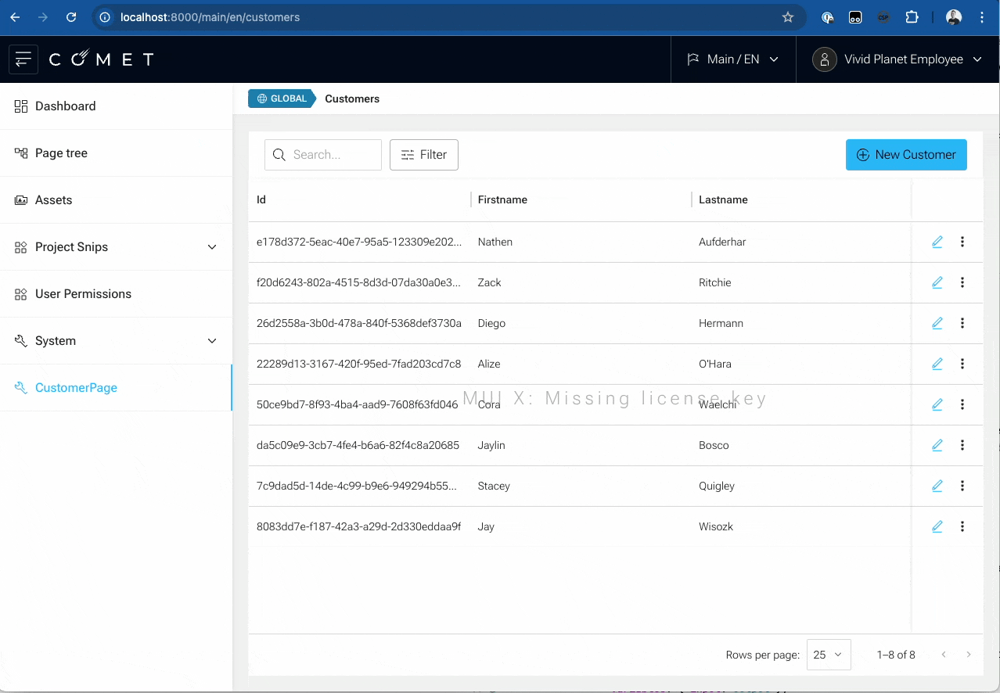

## Introduction

This guide will walk you through creating a new DataGrid and Form in a Comet application.

We will use the [API Generator](/docs/getting-started/crud-generator/api-generator) to create a new entity and the **Admin Generator** to generate the DataGrid for listing entities and the Form for editing them.

Finally, we will integrate the generated DataGrid and Form into a new page and make it available from the Main Menu.

