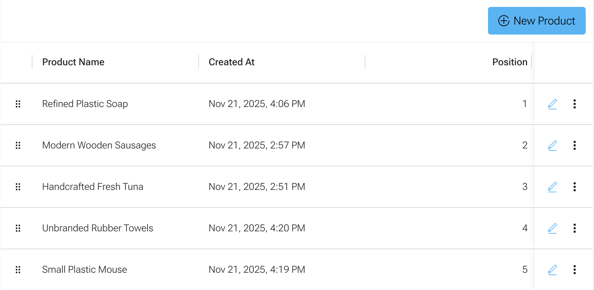

This guide will walk you through modifying an existing entity and its DataGrid to allow the admin user to re-order the entries using drag-and-drop.

This guide assumes the existing API and Admin were created using the API Generator and Admin Generator.
A detailed guide on this is available under [Generate Grid Form View](/docs/guides/generate-grid-form-views/).



## Updating the entity

In the entity, simply add the magic `position` field.
See its [documentation](/docs/getting-started/crud-generator/api-generator/#position) for more information.

```ts
@Field(() => Int)
@Property({ columnType: "integer" })
@Min(1)
position: number;
```

### Migrating the database

Generate and run a new migration for the field:

```sh
npm --prefix api run mikro-orm migration:create
npm --prefix api run mikro-orm migration:up
```

:::warning
If entries already exist in the database, you may need to modify the generated migration to set the `position` field to an initial value. The following example sets the position based on the creation date.

```ts
override async up(): Promise<void> {
    this.addSql(`alter table "MyEntity" add column "position" integer;`);
    this.addSql(
        `update "MyEntity" set "position" = numbered_myEntities.row_num from (select id, row_number() over (order by "createdAt") as row_num from "MyEntity") numbered_myEntities where "MyEntity".id = numbered_myEntities.id;`,
    );
    this.addSql(`alter table "MyEntity" alter column "position" set not null;`);
}
```

:::

### Update the module

Once the API of the entity has been regenerated, a new `MyEntity.service.ts` file should be present in the `generated/` subdirectory.
This service needs to be included in your module's `providers`.

```ts
@Module({
    // ...
    providers: [
        // ...
        MyEntityService,
    ],
})
export class MyEntityModule {}
```

## Updating the Grid generator config

In your `.cometGen.ts` file, add the `rowReordering` property to the grid config.

```ts
export const MyEntityGrid: GridConfig<GQLMyEntity> = {
    // ...
    rowReordering: {
        enabled: true,
    },
};
```

After regenerating the grid, you should be able to drag-and-drop the entries to change their position using the grab handle.
