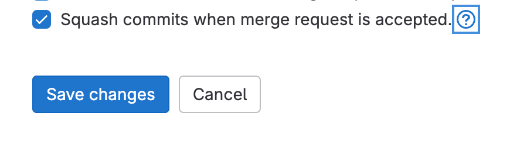
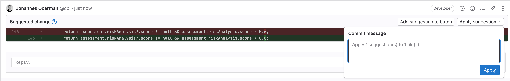
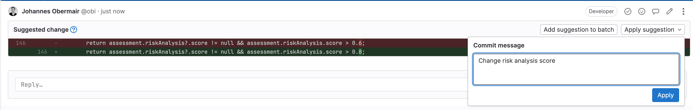
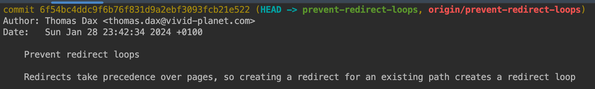
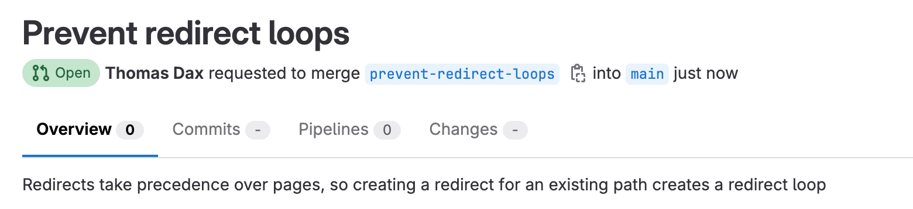

## General

- In principle, we follow the concept of [trunk-based development](https://www.atlassian.com/continuous-delivery/continuous-integration/trunk-based-development).
- We aim for a high level of quality in our source code.
- The Git commit history should be clean and understandable to make it easier to trace changes.

A clean Git history can be achieved in two ways:

- **Recommended:** On merge request level **(requires [squashing](https://www.geeksforgeeks.org/git/git-squash/))**
- On commit level

## Merge Requests

### Rules

- One merge request per change (feature, fix, or refactoring)
- If the `main` pipeline is red (i.e., not passing), nothing may be merged unless it contributes to fixing the issue (see also environments in [Kubernetes](./kubernetes))

### Goal

Make the review process as easy as possible for the reviewer.

### Possible measures:

- Link the relevant JIRA ticket
- Add the **Timr** time tracking entry
- Generate the MR description (JIRA ticket + Timr) using the GitLab button in JIRA
- Link the screen design
- Attach screenshots or screen recordings
- Keep merge requests as small as possible
- Avoid unnecessary dependencies (only add them if absolutely necessary)
- Do not combine multiple tasks in a single MR (e.g., bugfix and new feature in the same MR)

### Squashing

Squashing combines all commits of a merge request into a single commit during the merge process.

_Activation of squashing in MR_

The squash commit will include the title and description of the merge request.

#### Advantages:

- Improved integration between GitLab, Git, and IDEs  
  (Title, description, and links are included in the squash commit; the related MR can be more easily identified in the IDE)
- Commit messages within the MR become irrelevant. Suggestions can be applied directly without needing amends or force-pushes.  
  Concerns can be addressed in individual commits during the review.
- Title and description can be edited directly in GitLab, making it easier for reviewers or lead developers to adjust wording.

#### Disadvantages:

- Stacked MRs always cause conflicts (rebasing is required).
- Individual commits of the MR are no longer visible in the `main` branch.  
  You need to navigate to the MR in GitLab to view them.

#### Rules:

- Squashing is the recommended default setting.
- If a merge request has a messy commit history, it **must** be squashed.  
  :::caution
  All dependent (stacked) MRs must then be rebased.
  :::
- Even if the commit history is clean, squashing is still allowed.

### Selecting Reviewers

- All merge requests must go through peer review.
- The project's lead developer should generally review every merge request in the project.
- For infrastructure changes: always select someone from the **infra team**.
- For styling changes: always select someone from the **styling focus group**.
- A merge request can only be merged **after all reviewers have approved**.

:::caution
Always use **reviewers**, not approvers. The review system is better integrated into GitLab.
:::

### Conventions

- Merge requests prefixed with `Draft:` should only be reviewed if a reviewer has been explicitly assigned.

### Concerns

- Concerns should always be resolved by the **reviewer** (exception: obvious things like typos).
- A merge request may **only be merged once all concerns are resolved**.

### Commits

:::caution
The following rules apply **if the merge request is _not_ squashed**

Even if squashing is used, commit cleanliness is still important for easier reviews.
:::

- Commits should be **atomic** (i.e., the code should be in a runnable state).  
  Exception: if a CodeMod or CRUD generator is used, the generated changes should be in a **separate commit**, so they can be excluded from review.
- Prefer multiple small commits (e.g., separate docs and feature work).
- One commit per **logical change**.
- Write **clear and descriptive commit messages**:
    - Avoid vague messages like `fix`, `polish`, `wip`, or `another try`. These may be used temporarily, but must be cleaned up before merging.
    - Start commit messages with a **capital letter**.
- We recommend using **English** for all commit messages.

#### Meaningful Commits for Suggestions

When applying a suggestion, make sure to use a **meaningful commit message**.

:::warning Bad

:::

:::tip Good

:::

#### Tips for Writing Good Commit Messages

Use the imperative
:::warning Bad
Added margin to footer
:::

:::tip Good
Add margin to footer
:::

Explain **what** and **why**, not **how**
:::warning Bad
Add margin
:::

:::tip Good
Add margin to nav items to prevent them from overlapping the logo
:::

 

:::note
Use `git commit --amend` to update existing commits (force push required).
:::

:::note
Multi-line commit messages automatically fill the **description field** in GitLab MRs. This is preferred over writing explanations in the MR description, because:

- The information is stored directly in Git.
- It is more visible and better integrated into IDEs (e.g., via GitLens or JetBrains tools).
  :::
  

Results In:

### Reviews

Reviews are intended to ensure our quality standards are met. They should never be taken personally — see them as an opportunity for personal growth.

#### Objectives

- Keep the **bigger picture** in mind
    - Is the chosen technique appropriate?
    - Are the requirements fully covered?
- Identify potential bugs
- Check adherence to coding best practices
- Question security and data privacy concerns

#### Non-Objectives

- Imposing your own personal style on the developer
- Nitpicking
- Verifying code correctness (This is usually not possible and is the clear responsibility of the developer)

#### Conventions

Optional suggestions can be marked with:

- `OPT:`
- `Note:`
- `Nit:`

These are not mandatory to fix but are intended to support communication and knowledge sharing.

#### Tips for Reviewers

- If possible (e.g., typos), use **[GitLab Suggestions](https://docs.gitlab.com/user/project/merge_requests/reviews/suggestions/)** to make it easy to fix or highlight what should change.
- For naming concerns, provide a concrete improvement proposal.

### Feature Branches

#### Why?

If a feature takes longer to develop or multiple developers are working on it simultaneously, a **feature branch** should be created first.
These branches are **protected** — you **cannot push directly** to them. They serve only as a **target for multiple Merge Requests**. This prevents unfinished changes from being merged into the `master/main` branch too early.

#### How to Create?

Since you cannot push to them directly, you must create them via the GitLab UI:

> Navigate to `Repository → Branches → New Branch`.

:::caution
Protection only works if the branch name **starts with `feature/`**.
:::

#### What to Do in Case of Conflicts?

If the `master/main` branch has changed and causes conflicts in your feature branch:

- You cannot fix it via `rebase` (due to branch protection).
- Instead:
    - Create a **new branch**.
    - **Merge `master/main` into it**.
    - Fix the conflicts.
    - Create a new **Merge Request** for this branch.

#### How to Merge?

:::warning
Never merge feature branches **with squashing**.
:::

### Cherry Picking

In **production**, you may only cherry-pick commits that already exist in the `master/main` branch.

### FAQs

**Q:** Is it allowed to include a bugfix from an unrelated area in a PR that implements a specific feature (as a separate commit)?  
**A:** No.

**Q:** Should changes to `api`, `admin`, and `site` be split into separate commits, if done in one PR?  
**A:** No.
