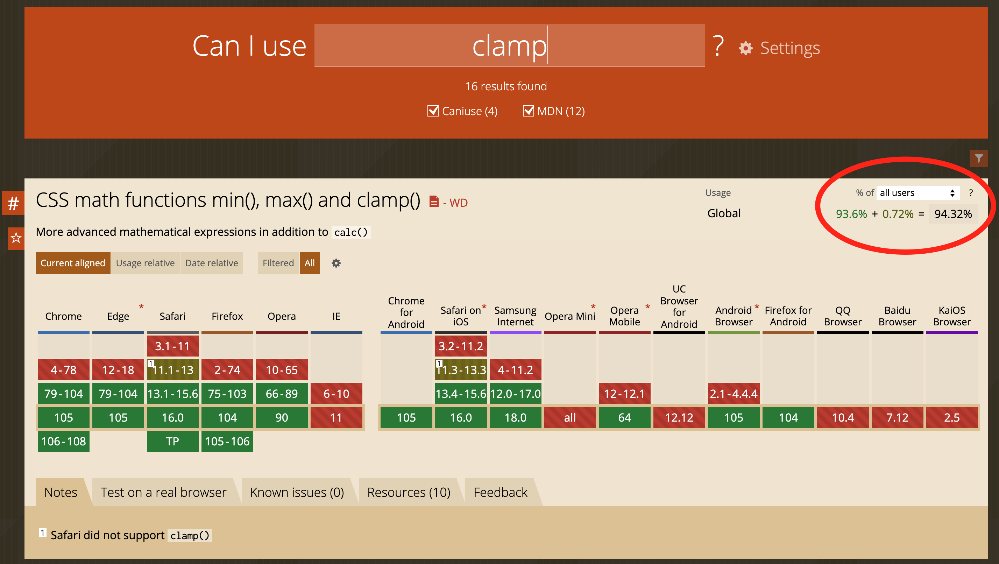

## Theme

- A theme should help developers style quickly and consistently. It should contain definitions/variables for: colors, buttons, forms, fonts, breakpoints, easings, typography.

### Color Naming

Besides basic color definitions (like primary, secondary, grey, etc.), there should be specific definitions with a context in mind (e.g. “colorUiLabel” with “colorUiLabelHover”). If there is no meaningful specific context for multiple uses, it is better to just use the basic colors.

### Buttons

Define buttons or form elements very specifically to reuse the theme structure in other applications.

:::tip Good

```ts
buttons: {
    primaryBg: "#ea5d1a",
    primaryBgHover: "#f08d5e",
    primaryBorder: "none",
    primaryBorderHover: "none",
    primaryBorderRadius: "4px",
    primaryHeightMobile: "46px",
    primaryFontSizeMobile: "16px",
    primaryHeightTablet: "46px",
    primaryFontSizeTablet: "16px",
    primaryHeightDesktop: "46px",
    primaryFontSizeDesktop: "16px",
    ...
}
```

:::

### Typography

For Typography you can take a step further and use css in theme:

:::tip Good

```ts
typography: {
      headline650: (disableMargin?: boolean) => css`
          font-size: 30px;
          line-height: 38px;
          font-weight: 900;
          margin-bottom: ${disableMargin ? 0 : "40px"};

          ${({ theme }) => theme.breakpoints.m.mediaQuery} {
              font-size: 68px;
              line-height: 94px;
              margin-bottom: ${disableMargin ? 0 : "56px"};
          }
      `,
      headline600: (disableMargin?: boolean) => css`
          font-size: 30px;
          line-height: 38px;
          font-weight: 900;
          margin-bottom: ${disableMargin ? 0 : "32px"};

          ${({ theme }) => theme.breakpoints.m.mediaQuery} {
              font-size: 50px;
              line-height: 58px;
              margin-bottom: ${disableMargin ? 0 : "36px"};
          }
      `,
      ...
      paragraph250: (disableMargin?: boolean) => css`
            font-size: 16px;
            line-height: 30px;
            margin-bottom: ${disableMargin ? 0 : "24px"};
            font-weight: 400;

            ${({ theme }) => theme.breakpoints.m.mediaQuery} {
                font-size: 18px;
            }
        `,
        paragraph200: (disableMargin?: boolean) => css`
            font-size: 16px;
            line-height: 30px;
            font-weight: 400;
            margin-bottom: ${disableMargin ? 0 : "18px"};
        `,
        ...
```

:::

### Spacing

One major part for consistent look and easy styling is defined spacing. Dynamic and Static are useful categories:

:::tip Good

```ts
const spacingValues: SpacingValues = {
    none: {
        xs: 0,
        s: 0,
        m: 0,
        l: 0,
        xl: 0,
        xxl: 0,
    },
    //dynamic
    d150: {
        xs: 4,
        s: 4,
        m: 4,
        l: 8,
        xl: 8,
        xxl: 8,
    },
    ...
    //static
    s150: 4,
    s200: 8,
    s250: 12,
    ...
```

:::

## Modern CSS3 Stuff / Browser Support

Check support with [CanIUse.com](https://caniuse.com).

Relevant value: **“All Users/Europe”**



### Frontend/Site

Anything with a usage share of **>= 93%** can be used freely.

Anything with a usage share of **>= 90%** can be used if the basic functionality is ensured. This means: The site must still work if this feature is not supported, but styling may
slightly differ or behavior may not feel perfect. Depending on the feature or deviation in behavior, this threshold may be lower. The final decision lies with the responsible stylist.

### Admin

Everything supported by Chrome, Firefox, and Safari can be used.

### Grid and Flex

Use CSS Grid and Flexbox to align elements. But only use them when necessary — it’s not required to set `display: flex` on every `div`.

:::tip Good

```ts
export const Wrapper = styled.div`
    display: grid;
    grid-template-columns: repeat(2, 1fr);
    ...
```

:::

### List and ListItem Styling

When styling a list to columns you should take the styling to the list and not to the item-block.

:::warning Bad

```tsx
// List.tsx
<List>
    {blocks.map((block) => (
        <Button key={block.key} data={block.props} />
    ))}
</List>;

export const List = styled.div`
    display: flex;
    flex-wrap: wrap;
`;

// Button.tsx
export const ButtonBlock = styled.div`
    width: 25%;
`;
```

:::

:::tip Good

```tsx
// List.tsx
<List>
    {blocks.map((block) => (
        <Item key={block.key}>
            <Button data={block.props} />
        </Item>
    ))}
</List>;

export const List = styled.div`
    display: flex;
    flex-wrap: wrap;
`;

export const Item = styled.div`
    width: 25%;
`;
```

:::

### Recommendation: Empty Lines

For better code readability, it is recommended to make a empty line between css and every form of selector:

:::warning Bad

```tsx
const ImageWrapper = styled.div`
    display: inline-block;
    max-height: 200px;
    max-width: 200px;
    cursor: pointer;
    ${({ theme }) => theme.breakpoints.m.mediaQuery} {
        max-width: 160px;
        max-height: 160px;
    }
    ${({ theme }) => theme.breakpoints.l.mediaQuery} {
        max-width: 200px;
        max-height: 200px;
    }
    &:hover {
        opacity: 0.5;
    }
`;
```

:::

:::tip Good

```tsx
const ImageWrapper = styled.div`
    display: inline-block;
    max-height: 200px;
    max-width: 200px;
    cursor: pointer;

    ${({ theme }) => theme.breakpoints.m.mediaQuery} {
        max-width: 160px;
        max-height: 160px;
    }

    ${({ theme }) => theme.breakpoints.l.mediaQuery} {
        max-width: 200px;
        max-height: 200px;
    }

    &:hover {
        opacity: 0.5;
    }
`;
```

:::

### Mobile First Approach

When styling a site, block or component, always start with the mobile layout. [The Mobile First approach](https://css-tricks.com/how-to-develop-and-test-a-mobile-first-design-in-2021/) helps us to reach the majority of users and provides them with a good-looking page.

### Inline Styles

If possible, don’t use inline styles, use Emotion or Styled Components instead.

:::warning Bad

```tsx
<IconButton onClick={() => handleDelete(key)} style={{ padding: "0 0 8px 8px" }}>
```

:::

:::tip Good

```tsx
import { IconButton as MuiIconButton } from "@mui/material";

const IconButton = styled(MuiIconButton)(() => ({
    padding: "0 0 8px 8px",
}));

<IconButton onClick={() => handleDelete(key)} />;
```

:::

or even better name the button after its function.

:::tip Good

```tsx
import { IconButton } from "@mui/material";

const DeleteButton = styled(IconButton)(() => ({
    padding: "0 0 8px 8px",
}));

<DeleteButton onClick={() => handleDelete(key)} />;
```

:::
