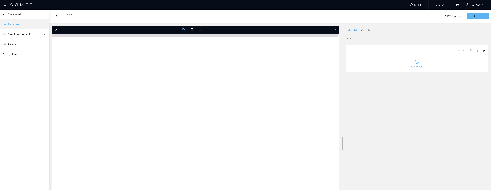
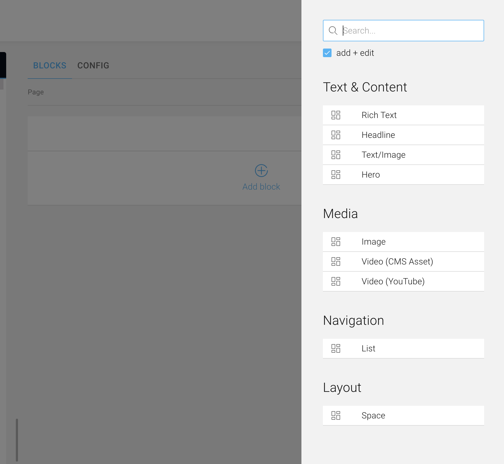

## Navigating the admin

COMET is split into three main parts: **admin**, **api** and **site**.  
Read [here](https://docs.comet-dxp.com/docs/overview/Microservices) for an explanation of each part.

Let's make ourselves familiar with the admin first:

1. Open `localhost:8000` in your browser.
2. Navigate to [Page tree](https://docs.comet-dxp.com/docs/page-tree/) and click on the `Add` button.
3. Inside the `Name` input field, type in _Home_.

:::info
A page named _home_ will automatically be used as the **index page**.
:::

3. Click on the newly created **Home** page.

In the middle, you can see the [preview](https://docs.comet-dxp.com/docs/preview/) of your page.

On the top bar, you can switch between various viewports.

On the right side, you can create your content by adding blocks. Here you can see and use all the pre-built block that come with the COMET starter app.

As you can see, the blocks can be **categorized**.

4. Try to add a **Headline**, a **Rich Text** and an **Image** Block.

## Building custom blocks

Most projects require more functionality and styling than the base COMET provides. We can build our own custom block that can be utilized exactly like we did before.

A block needs to be created in all 3 main parts of the application - api, admin and site - and registered in their corresponding page documents.
In total we are going to edit 6 separate files.

Now we move on to creating our first custom block!
