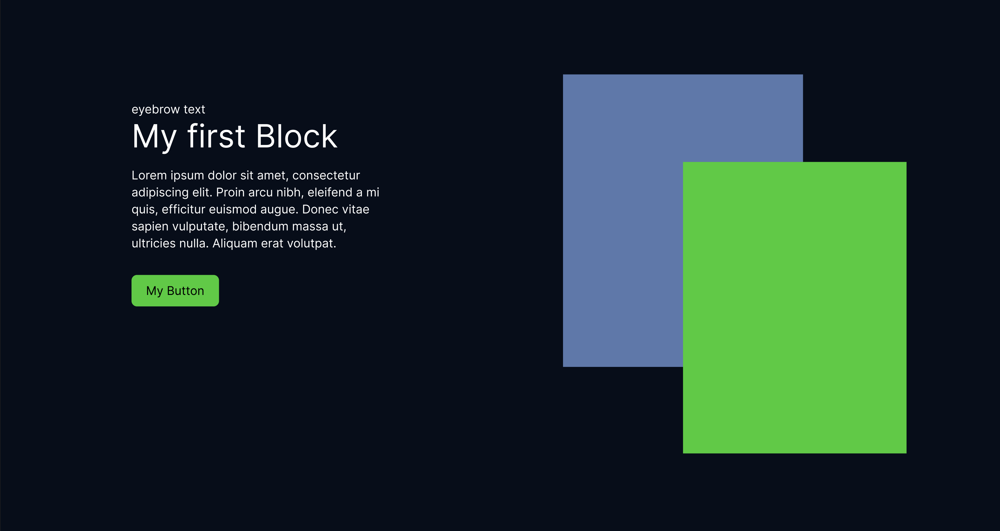
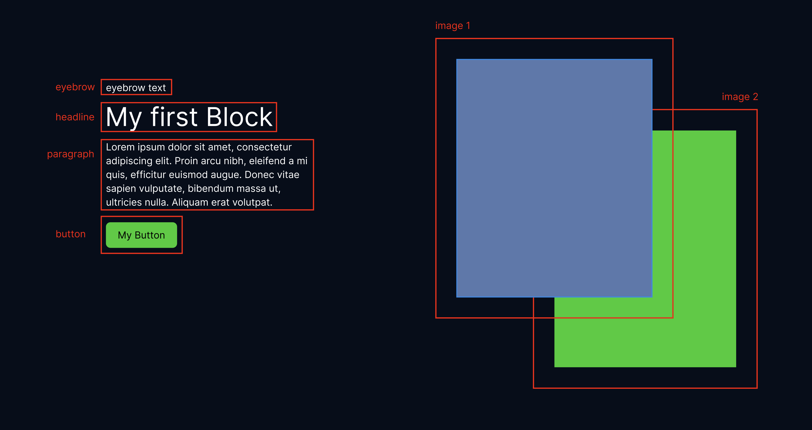

# Welcome to your first COMET project!

This is an interactive tutorial to make you familiar with the COMET content management system and provide guidance for your first steps.

This tutorial will cover

-   how to build this block
-   how to style this block
-   how to write a migration

We will call this block `hero`. It consists of several sub elements/blocks:

-   an eyebrow
-   a headline
-   a paragraph
-   a button
-   two images

