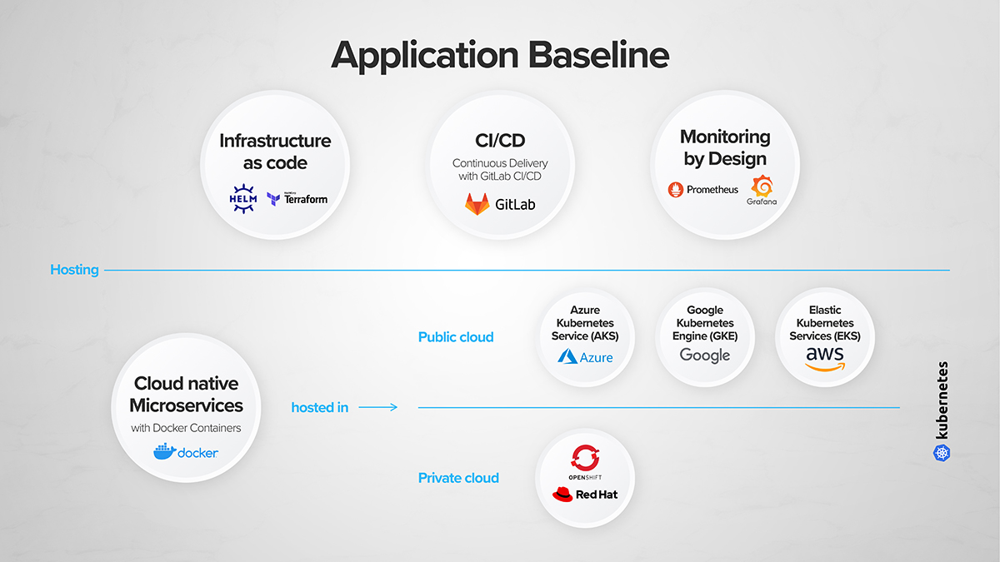
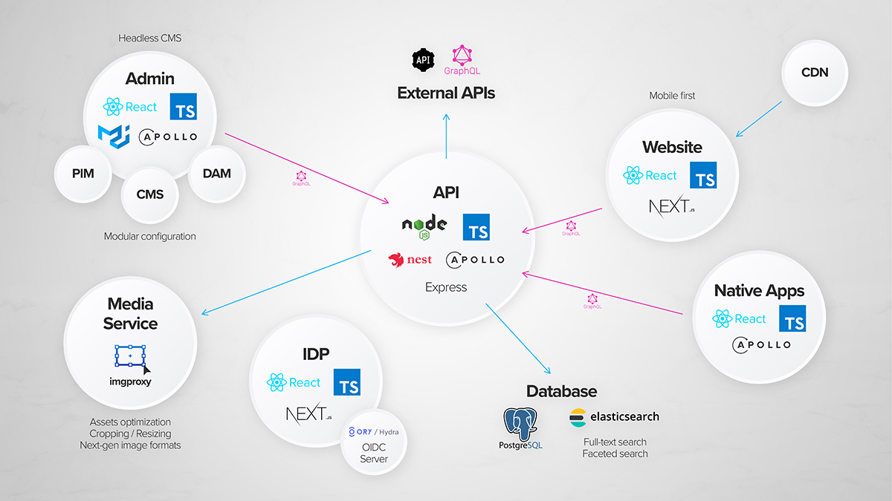

COMET DXP is a highly customizable platform for building modern applications based on a headless CMS.

The following design principles are considered:

- [The Twelve-Factor App](https://12factor.net/)
- Cloud-Native ([foundation/charter.md at main · cncf/foundation](https://github.com/cncf/foundation/blob/main/charter.md#1-mission-of-the-cloud-native-computing-foundation))
- Microservices ([What are microservices?](https://microservices.io/))
- Headless ([Headless content management system](https://en.wikipedia.org/wiki/Headless_content_management_system))
- Infrastructure as Code ([What is Infrastructure as Code (IaC)?](https://www.redhat.com/en/topics/automation/what-is-infrastructure-as-code-iac))
- Mobile first
- Typescript everywhere

The following diagram visually highlights these principles.

A typical COMET DXP application consists of multiple microservices which are shown in the following diagram.

:::note

Many of the highlighted microservices can be exchanged or omitted.

:::

## Why not just use an off-the-shelf solution?

- We want a solution that is highly customizable
- We want to offer excellent developer experience (DX)
- We want to host on-premise

You can build two types of applications with COMET DXP:

- **Content websites**: Websites that are primarily content-driven without a lot of structured data. Content websites heavily use the CMS features (page tree, blocks etc.) and have at least one site.
- **Data-driven applications**: Applications that are primarily data-driven. Data-driven applications might not use the CMS features and might not have a site at all.

:::note
This terms are used throughout the documentation as some concepts heavily differ between this two types.
:::
